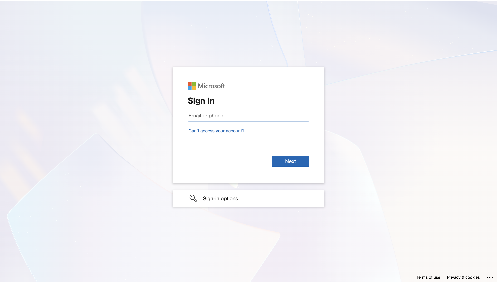

# Lab 00: Environment Setup — Zava Corporation AI Agent Infrastructure

## Introduction

**Zava Corporation** is a mid-sized financial services and HR consulting firm operating across the UK and EU. Zava manages sensitive employee records, client financial data, and third-party vendor contracts. The organisation has recently deployed AI agents across its HR, Finance, and IT Support functions to improve operational efficiency.

Acting as various personas in Zava's developer and security team, your first task is to build the operational baseline: establish the identity infrastructure in Microsoft Entra ID, enable agent authoring in Copilot Studio, create the three agents the business has commissioned, and populate their SharePoint knowledge sources with realistic sensitive documents. Once the environment is ready, security governance work can begin.

Before any security configuration can begin, the Zava Corporation environment must be enabled to prepare for Agent 365. In this lab, **MOD Administrator** will configure the Microsoft Entra ID tenant using the Microsoft Entra admin center, enable Microsoft Copilot Studio, register the security group required for agent authoring, create the three AI agents that serve as governance targets throughout the entire course, connect each agent to its designated SharePoint knowledge source, and upload the sample business documents that simulate Zava's live data environment.

Every subsequent lab depends on the agents, identities, and files created here. Complete all three exercises in order before proceeding to Lab 01.

---

   > **Note:** In a real-world environment, the responsibilities outlined here would be distributed across multiple personas—such as developers, IT administrators, security administrators, and compliance officers—each operating with scoped permissions aligned to the principles of least privilege and Zero Trust. These roles would have restricted access to specific features based on their responsibilities. However, due to time and environment constraints, this lab does not replicate that separation of duties. Instead, all setup and configuration tasks will be performed by a single persona: the Moderator Administrator (MOD Admin) who has a Global administrator role assigned in Microsoft.


---

## Objectives

- Create a role-assignable security group in Microsoft Entra ID and assign it the Privileged Role Administrator role.
- Enable the **copilotagentsecurity** group as the authorised Copilot Studio Authors group in Power Platform Admin Center.
- Enable Entra Agent Identity for Copilot Studio at the environment level.
- Connect SharePoint as a data source in the Power Apps maker portal.
- Create three Copilot Studio agents: Zava HR Assistant, Zava Finance Agent, and Zava IT Support Agent.
- Connect each agent to its designated SharePoint knowledge source.
- Publish each agent and share it with the appropriate lab users.
- Upload Zava sample business documents to the HR and Finance SharePoint sites.
- Verify that all three agents appear as Active in the Microsoft Agent 365 Agent Registry.

---

## Lab Duration

Estimated time: **30 minutes**

---

## Exercise 1: Configure Entra ID and Enable Copilot Studio Authors

### Task 1: Sign In and Configure Multi-Factor Authentication

1. Open a browser and navigate to `https://entra.microsoft.com`.

	

2. On the sign-in page, enter the **MOD Administrator** credentials from the **Resources** tab of your lab environment.

	
	

3. If prompted with a **Keep your account secure** window, select **Next**.

	

4. Follow the on-screen prompts to set up the Microsoft Authenticator app.

   > **Note:** On your mobile device, open the Authenticator app, select **+** in the top-right corner, select **Work or school account**, and then select **Scan a QR code**. Scan the QR code displayed on screen.

	

5. Complete all remaining prompts to finish the Authenticator setup.

	

6. If asked **Stay signed in?**, select **Yes**.

	

7. On the Microsoft Entra admin center welcome screen, select **Get Started**.

	

---

### Task 2: Create the copilotagentsecurity Security Group

1. In the Microsoft Entra admin center, in the left navigation pane, expand **Entra ID**. Under **Entra ID**, select **Groups**.

	

3. On the **Overview** page, select **New group**.

	

4. On the **New Group** page, configure the following fields:

   - **Group type:** Select **Security**.
   - **Group name:** Enter `copilotagentsecurity`.
   - **Microsoft Entra roles can be assigned to the group:** Select **Yes**. If this option is not visible, skip this field and continue.

	

5. Under **Owners**, select **No owners selected**.

	

6. On the **Add owners** panel, search for and select **MOD Administrator**. Choose **Select** to confirm the owner.

	

8. Under **Members**, select **No members selected**.

	

9. On the **Add members** panel, search for and select **MOD Administrator** and **Patti Fernandez**. Select **Select** to confirm the member.

	

11. Under **Roles**, select **No roles selected**.

	

12. On the **Select roles** panel, search for `Global admin`, select **Global Administrator**, and then select **Select**.

	

13. Select **Create**.

	

14. In the confirmation dialog, select **Yes**.

	

15. Confirm that a success notification appears at the top of the page.

	
	

---

### Task 3: Enable Access Management for Azure Resources

1. In the left navigation pane of the Microsoft Entra admin center, expand **Entra ID**. Under **Entra ID**, select **Overview**.

	

3. On the **Overview** page, select **Properties** from the top bar.

	

4. On the **Properties** page, locate the **Access management for Azure resources** toggle and set it to **Yes**.

	

5. Select **Manage security defaults**.

	

6. On the **Security defaults** panel, under **Security defaults**, select **Enabled**. Select **Save**.

	

8. Return to the **Properties** page and select **Save**.

	

---

### Task 4: Assign the Privileged Role Administrator Role

1. In the left navigation pane of the Microsoft Entra admin center, expand **Entra ID** and select **Roles & admins**.

	

3. On the **Roles and administrators** page, in the search bar, enter `privileged role admin`.

	

4. In the search results, select **Privileged Role Administrator** by selecting its name. Do not select the checkbox next to it.

	

5. On the **Privileged Role Administrator** page, select **+ Add assignments**.

	

6. On the **Add assignments** panel, select **No members selected**.

	

7. On the **Select members** panel, search for and select **copilotagentsecurity**. Select **Select** to confirm.

	

9. Select **Next**.

	

10. On the **Settings** step, under **Assignment type**, select **Active**. In the **Enter justification** field, enter `Successful lab completion`.

11. Select **Assign**.

	

12. Confirm that the role assignment appears in the assignments list.

	

---

### Task 5: Configure Copilot Studio Authors in Power Platform Admin Center

1. Open a new browser tab and navigate to `https://admin.powerplatform.microsoft.com`.

2. In the left navigation pane, select **Manage**.

	

3. Under **Manage**, select **Tenant Settings**. On the **Tenant Settings** page, locate and select **Copilot Studio Authors** from the list.

	

5. On the **Copilot Studio Authors** panel, select the **Edit** icon near security group.

	

6. In the search field, enter `copilotagentsecurity`. Select the **copilotagentsecurity** group from the results.

	

8. Select **Save** to apply the setting.

	

---

### Task 6: Enable Entra Agent Identity for Copilot Studio

1. Remain in the Power Platform Admin Center at `https://admin.powerplatform.microsoft.com`. In the left navigation pane, select **Copilot**.

	

3. On the **Copilot** page, select **Settings**.

	

4. In the settings list, under the **Copilot Studio** section, select **Entra Agent Identity for Copilot Studio**.

5. On the **Entra Agent Identity for Copilot Studio** panel, select the **Dev One** environment from the environment list. Select **Edit setting**.

	

7. On the setting panel, select **On**.

	

8. Select **Save**.

	

9. After saving, close the panel.

	

   > **Note:** Enabling Entra Agent Identity allows Copilot Studio agents to be automatically assigned a unique identity in Microsoft Entra ID. This is required for identity governance, Conditional Access, and Defender for Cloud Apps integration in later labs.

---

### Task 7: Add a SharePoint Connection in the Power Apps Maker Portal

1. Open a new browser tab and navigate to `https://make.powerapps.com` and sign in with **MOD Administrator** credentials if prompted.

2. If prompted, on the **Welcome to Power Apps**, slect **United States** and then select **Get started**.

	

3. In the top-right corner, confirm that the **Dev One** environment is selected in the environment switcher. If not, select the environment switcher and select **Dev One**.

	

4. In the left navigation bar, expand **More** and select **Connections**.

	

6. On the **Connections** page, select **+ New connection**.

	

7. In the connector search bar, enter `SharePoint`. Select **SharePoint** from the list of available connectors.

	

9. On the **SharePoint** connection panel, select **Connect directly (cloud services)**. Select **Create**.

	

11. When prompted, sign in with **MOD Administrator** credentials to authorise the connection and select **Allow access**.

	

12. Confirm that the SharePoint connection appears in the **Connections** list with a status of **Connected**.

	

---

## Exercise 2: Create the Zava Copilot Studio Agents

In this exercise, MOD Administrator creates all three Zava agents in Microsoft Copilot Studio. Each agent is configured with a name, description, instructions, and a SharePoint knowledge source. After publishing, each agent is shared with the designated lab user accounts. These agents serve as the live governance targets in Labs 01 through 07.

---

### Task 1: Create the Zava HR Assistant

1. Open a new browser tab and navigate to `https://copilotstudio.microsoft.com`. Sign in with **MOD Administrator** credentials if prompted.

3. On the **Welcome** screen, locate the environment switcher in the top-right corner of the page.

4. If the current environment is not **Dev One**, select the environment switcher and select **Dev One** from the dropdown list.

	>Important: If the Copilot Studio does not load or show up the option to select **Environment** as in the below >screenshot, then follow the below steps.
    
    >Open `https://admin.powerplatform.microsoft.com/`. Select **Manage** > **Environments > Dev One** and >select the value of the **Environment ID**.
    
	>Navigate back to the Copilot Studio tab and open `https://copilotstudio.microsoft.com/environments/< EnvironmentID>` (Replacing < EnvironmentID> with the value fetched above)

	

5. In the left navigation pane, select **Agents**.

	

7. On the **Create an agent** page, select **Create blank agent**.

	

8. On the agent configuration page, select **Edit** under **Details**.

	

9. in the **Name** field, enter `Zava HR Assistant`.

9. In the **Description** field, enter `An AI assistant that helps Zava employees find HR policies, benefits information, and employee procedures.`

10. Select **Save**.

	

10. In the **Instructions** field, select **Edit** and enter the following and select **Save**.

    ```
    You are the Zava HR Assistant. Answer questions using only the information available in the Zava HR SharePoint knowledge base. Do not speculate or provide information outside the knowledge base. Always respond professionally.
    ```

11. On the agent configuration page, locate the **Knowledge** section. Select **+ Add knowledge**.

	

13. On the **Add knowledge** panel, select **SharePoint**.

	

14. In the **SharePoint URL** field, enter the SharePoint HR site URL in the following format and select **Add**:
    `https://[TenantPrefix].sharepoint.com/sites/HR`

    > **Note:** Replace [TenantPrefix] with your tenant prefix found on the **Resources** tab of your lab environment.

	

15. Select **Add to agent** to connect the SharePoint site as the knowledge source.

	

16. In the top-right corner of the agent configuration page, select **Publish**.

	

17. In the confirmation dialog, select **Publish** to confirm.

	

18. On the agent configuration page, locate the **Channels** tab on the top section (select +2 if it is not directly visible).

	
	

19. Select **Microsoft 365 Copilot and Microsoft Teams** to add them as channels.

	

20. Then select **Add channel**.

	

21. Select **Availability options**.

	

22. On the **Microsoft 365 Copilot and Microsoft Teams** page, select **Show to everyone in my org**.

	

23. Select **Submit to org catalog**.

	

24. On the **Give everyone access to this agent?** in the confirmation dialog, select **Yes**.

	

25. You will get redirected **Show in Teams app store for org** and show a notification **Your agent is submitted and waiting for approval from your Teams admin**.

	

---

### Task 2: Create the Zava Finance Agent

1. In the left navigation pane, select **Create**.

2. On the **Create** page, select **New agent**.

3. On the **Create an agent** page, select **Skip to configure**.

4. On the agent configuration page, in the **Name** field, enter `Zava Finance Agent`.

5. In the **Description** field, enter `An AI assistant that helps Zava finance team members retrieve budget information, invoice data, and financial reports.`

6. In the **Instructions** field, enter the following:

    ```
    You are the Zava Finance Agent. Answer questions using only the information in the Zava Finance SharePoint knowledge base. Do not share financial data with users who have not been granted access to the Finance SharePoint site. Always respond professionally and flag any requests for data outside your knowledge base.
    ```

7. On the agent configuration page, locate the **Knowledge** section.

8. Select **+ Add knowledge**.

9. On the **Add knowledge** panel, select **SharePoint**.

10. In the **SharePoint URL** field, enter the SharePoint Finance site URL in the following format:
    `https://[TenantName].sharepoint.com/sites/ZavaFinance`

    > **Note:** Replace `[TenantName]` with your tenant prefix from the **Resources** tab.

11. Select **Add** to connect the SharePoint site as the knowledge source.

16. In the top-right corner of the agent configuration page, select **Publish**.

17. In the confirmation dialog, select **Publish** to confirm.

18. On the agent configuration page, locate the **Channels** tab on the top section (select +2 if it is not directly visible).

19. Select **Microsoft 365 Copilot and Microsoft Teams** to add them as channels.

20. Then select **Add channel**.

21. Under **Decide who you want to show your agent to:**, select **Show to my teammates and shared users**.

18. On the **Share "Zava Finance Agent" in Teams** panel, in the search field, enter `Patti Fernandes`.

19. Select **Patti Fernandes** from the results.

21. Select **Patti Fernandes** again and on the right panel, select the **Editor** role.

20. In the search field, enter `Megan Bowen`.

21. Select **Megan Bowen** from the results.

22. In the search field, enter `Alex Wilber`.

23. Select **Alex Wilber** from the results.

24. Select **Update** to apply the sharing configuration.

---

### Task 3: Create the Zava IT Support Agent

1. In the left navigation pane, select **Create**.

2. On the **Create** page, select **New agent**.

3. On the **Create an agent** page, select **Skip to configure**.

4. On the agent configuration page, in the **Name** field, enter `Zava IT Support Agent`.

5. In the **Description** field, enter `An AI assistant that helps Zava employees resolve common IT issues, submit support requests, and find IT policy documentation.`

6. In the **Instructions** field, enter the following:

    ```
    You are the Zava IT Support Agent. Help users with common IT questions using publicly available Microsoft support documentation and Zava IT policies. Do not access or share any sensitive financial or HR information. Escalate complex issues to the IT helpdesk.
    ```

7. On the agent configuration page, locate the **Knowledge** section.

8. Select **+ Add knowledge**.

9. On the **Add knowledge** panel, select **Public Website**.

10. In the **URL** field, enter the following site URL:
    `https://support.microsoft.com/`

11. Select **Add** to connect the SharePoint site as the knowledge source.

16. In the top-right corner of the agent configuration page, select **Publish**.

17. In the confirmation dialog, select **Publish** to confirm.

18. On the agent configuration page, locate the **Channels** tab on the top section (select +2 if it is not directly visible).

19. Select **Microsoft 365 Copilot and Microsoft Teams** to add them as channels.

20. Then select **Add channel**.

21. Select **Availability options**.

22. On the **Microsoft 365 Copilot and Microsoft Teams** page, select **Show to everyone in my org**.

23. Select **Submit to org catalog**.

24. On the **Give everyone access to this agent?** in the confirmation dialog, select **Yes**.

25. You will get redirected **Show in Teams app store for org** and show a notification **Your agent is submitted and waiting for approval from your Teams admin**.

---

## Exercise 3: Upload Zava Knowledge Files to SharePoint

In this exercise, MOD Administrator uploads the Zava sample business documents to the SharePoint HR and Finance sites. These files contain the sensitive data — including employee PII, payroll records, credit card numbers, and financial forecasts — that will trigger security detections and DLP policy matches throughout Labs 04, 05, and 07.

---

### Task 1: Upload Files to the Zava HR SharePoint Site

1. Open a new browser tab and navigate to `https://[TenantName].sharepoint.com/sites/ZavaHR`.

   > **Note:** Replace `[TenantName]` with your tenant prefix from the **Resources** tab.

2. In the left navigation pane, select **Documents**.

3. On the **Documents** page, select **Upload**.

4. In the **Upload** dropdown, select **Files**.

5. In the file picker, navigate to the **Lab Files** folder on your lab VM desktop.

6. Select the following files and then select **Open** to upload them:

   | Filename | Contains |
   |---|---|
   | `Zava_HR_Policy_2024.docx` | Leave and disciplinary policy — no PII |
   | `Zava_Employee_Records.xlsx` | Employee IDs (format: ZVA123456), names, DOB, salary |
   | `Zava_Payroll_Q1_2025.xlsx` | Payroll data with credit card numbers in expense column |
   | `Zava_Onboarding_Guide.docx` | Standard onboarding content |
   | `Zava_Benefits_Summary.pdf` | Insurance and pension details |
   | `Zava_Org_Chart.docx` | Reporting lines and management structure |
   | `Zava_Termination_Checklist.docx` | Departing employee process with names and dates |
   | `Zava_Sick_Leave_Report.xlsx` | Employee names and illness reasons |

7. Wait for all 8 files to finish uploading.

8. On the **Documents** page, confirm that all 8 files appear in the document library.

9. Select **Zava_Employee_Records.xlsx** to open it.

10. Confirm that the file opens and displays employee data including employee IDs, names, and salary information.

11. Close the file and return to the **Documents** library.

---

### Task 2: Upload Files to the Zava Finance SharePoint Site

1. Open a new browser tab and navigate to `https://[TenantName].sharepoint.com/sites/ZavaFinance`.

   > **Note:** Replace `[TenantName]` with your tenant prefix from the **Resources** tab.

2. In the left navigation pane, select **Documents**.

3. On the **Documents** page, select **Upload**.

4. In the **Upload** dropdown, select **Files**.

5. In the file picker, navigate to the **Lab Files** folder on your lab VM desktop.

6. Select the following files and then select **Open** to upload them:

   | Filename | Contains |
   |---|---|
   | `Zava_Budget_2025.xlsx` | Department budgets and cost centres |
   | `Zava_Invoice_Log.xlsx` | Vendor invoices with IBAN and account numbers |
   | `Zava_Expense_Report_Alex.xlsx` | Alex Wilber's expenses with Visa credit card number |
   | `Zava_Audit_Report_2024.docx` | Internal audit findings — marked Confidential |
   | `Zava_Contracts_External.docx` | Third-party vendor contract — externally shared |
   | `Zava_Financial_Projections.xlsx` | Revenue forecasts with broad SharePoint permissions |

7. Wait for all 6 files to finish uploading.

8. On the **Documents** page, confirm that all 6 files appear in the document library.

9. Select **Zava_Expense_Report_Alex.xlsx** to open it.

10. Confirm that the file opens and displays expense data including credit card information.

11. Close the file and return to the **Documents** library.

---
### Task 3: Verify Agents in the Microsoft Agent 365 Agent Registry

1. Open a new browser tab and navigate to `https://admin.microsoft.com`.

2. Sign in with **MOD Administrator** credentials if prompted.

3. In the left navigation pane, select **Agents**. If this option is not visible, select **AI** and then select **Agents**.

4. Select **All agents**.

5. On this page, confirm that the following three agents appear in the list: (You can confirm it by searcing for Zava in the search box.

   | Agent Name | Status | Publisher |
   |---|---|---|
   | Zava HR Assistant | Active | Default Publisher |
   | Zava Finance Agent | Active | Default Publisher |
   | Zava IT Support Agent | Active | Default Publisher |

   > **Note:** It may take up to 10 minutes after publishing in Copilot Studio for agents to appear in the Agent Registry. If the agents are not visible, wait 10 minutes and then refresh the page.

---

## Summary

In this lab, you completed the full environment baseline for the Zava Corporation AI security course. You created a role-assignable security group in the Microsoft Entra admin center, configured MOD Administrator as owner and member, assigned the Privileged Role Administrator role, and enabled the group as the authorised Copilot Studio Authors group in Power Platform Admin Center. You enabled Entra Agent Identity for Copilot Studio at the environment level, which allows agents to be governed as first-class identities in the Microsoft security stack. You added a SharePoint connection in the Power Apps maker portal to enable knowledge source connectivity for agents. You created three Copilot Studio agents — Zava HR Assistant, Zava Finance Agent, and Zava IT Support Agent — each connected to a designated knowledge source, published across Teams and Microsoft 365 channels, and shared with respective users. You uploaded 14 sample business documents containing realistic sensitive data across the Zava HR and Finance SharePoint sites. Finally, you verified that all three agents are registered and Active in the Microsoft Agent 365 Agent Registry. The environment is now fully prepared for security configuration in Labs 01 through 07.