# Lab 02: Entra Agent Identity の構成と監視

## 概要

Zava のセキュリティチームは、CISO から、Day 2 セキュリティポリシー構成が開始される前に、すべての AI エージェント識別情報をレビューし、ガバナンスの下に置く必要があることを確認するよう指示を受けました。Lab 01 のレジストリチェックにより、エージェントがアクティブで可視化されていることが確認されました。ただし、エージェント識別情報の所有権が割り当てられておらず、これらの識別情報が現在保持している権限やロールが検証されていません。

Zava 環境にデプロイされたすべての Copilot Studio エージェントは、Lab 00 で Entra Agent Identity が有効化されたときに、Microsoft Entra ID で一意の識別情報が自動的に割り当てられました。これらの識別情報は Microsoft Entra 管理センターの **[Agent ID]** セクションに表示され、テナント内の他の識別情報と同様にガバナンスできます。所有者、スポンサー、アクセス制御、監査ログ、および条件付きアクセスポリシーを使用してガバナンスします。

このラボでは、Zava エージェント識別情報を特定し、現在の構成をレビューし、Patti Fernandes を Zava Finance Agent の所有者として割り当て、Zava HR Assistant 識別情報を無効にして再度有効にして、アイデンティティ隔離アクションをシミュレートします。

---

## 目的

- Microsoft Entra 管理センターの Entra agents を介してすべての Zava エージェント識別情報を特定する。
- ステータス、スポンサー、所有者、Blueprint ID、オブジェクト ID、作成日などのエージェント識別情報メタデータをレビューする。
- Patti Fernandes を Zava Finance Agent エージェント識別情報の所有者として割り当てる。
- エージェント識別情報に割り当てられている現在の権限と Entra ロールをレビューする。
- エージェント識別情報の利用可能な監査ログおよびサインインログエントリを検査する。
- エージェント識別情報パネルから条件付きアクセスポリシーとアクセスパッケージリンクをレビューする。
- Zava HR Assistant 識別情報を無効にし、エンドユーザーアクセスがブロックされることを確認する。
- Zava HR Assistant 識別情報を再度有効にし、アクティブステータスに戻ることを確認する。

---

## ラボ所要時間

推定所要時間：**10分**

---

## 演習 1: Zava Finance Agent エージェント識別情報を特定・検査する

### タスク 1: Entra Agent Identities に移動する

1. ブラウザを開き、Microsoft Entra 管理センターに移動してサインインします。プロンプトが表示された場合は **ODL User** 認証情報を使用します。

    ```
    https://entra.microsoft.com
    ```
 
   - **メールアドレス/ユーザー名:** <inject key="AzureAdUserEmail"></inject>
   - **パスワード:** <inject key="AzureAdUserPassword"></inject>
 

2. 左側のナビゲーションペインで、**[エージェント]** を選択します。**[エージェント識別情報]** ページで、テナントに登録されているエージェント識別情報のリストをレビューします。

	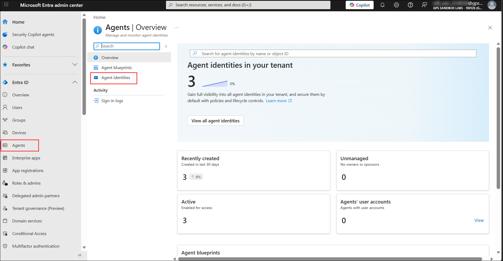

3. 次の3つのエージェントがリストに表示されていることを確認します。

   | 表示名 | ステータス |
   |---|---|
   | Zava HR Assistant (Microsoft Copilot Studio) | アクティブ |
   | Zava Finance Agent (Microsoft Copilot Studio) | アクティブ |
   | Zava IT Support Agent (Microsoft Copilot Studio) | アクティブ |

	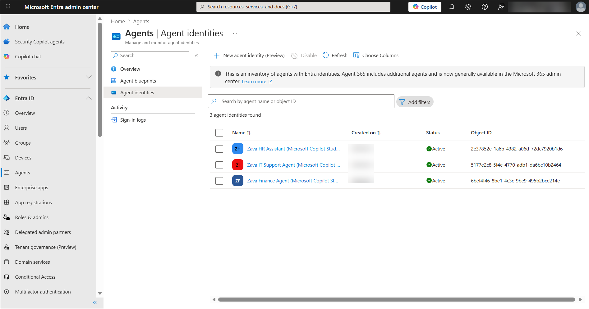

   > **注記:** エージェント識別情報には **(Microsoft Copilot Studio)** というサフィックスが付いており、それらをプロビジョニングしたプラットフォームを示します。エージェントがリストに表示されていない場合は、5分待ってページを更新してください。エージェント識別情報のプロビジョニングは Copilot Studio での初期公開後に時間がかかる場合があります。

---

### タスク 2: Zava Finance Agent エージェント識別情報概要をレビューする

1. **[エージェント識別情報]** ページで、**[Zava Finance Agent (Microsoft Copilot Studio)]** を選択します。

	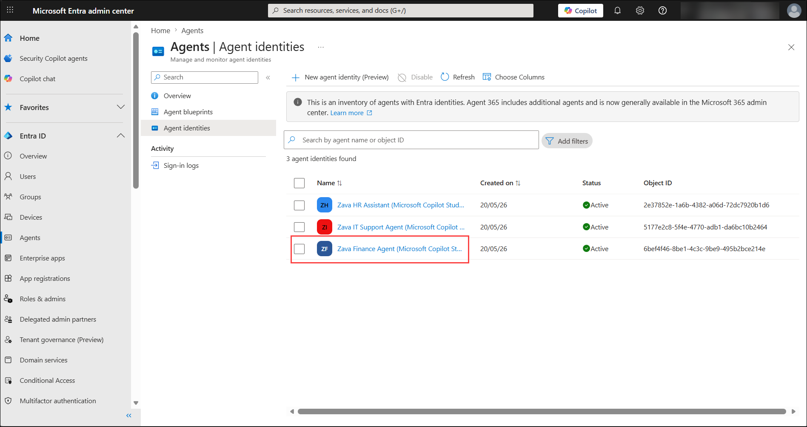

2. **[概要]** ページで、以下のフィールドをレビューしてメモします。

   - **ステータス** — **[アクティブ]** と表示されることを確認します。
   - **スポンサー** — 現在スポンサーとしてリストされているユーザーアバターをメモします。
   - **所有者** — 現在の値を確認します。所有者が割り当てられているか、またはフィールドがダッシュ( **-** )を表示しているか（所有者が設定されていないことを示す）をメモします。
   - **Blueprint ID** — GUID 値をメモします。
   - **オブジェクトID** — GUID 値をメモします。
   - **エージェントブループリント** — リンクテキストをメモします(Microsoft Copilot Studioエージェント識別情報)。
   - **作成日** — 日付をメモします。

3. 右側のパネルの **[エージェント識別情報のアクセス]** の下で、以下の現在の値をメモします。

   - **権限**
   - **Entraロール**

	   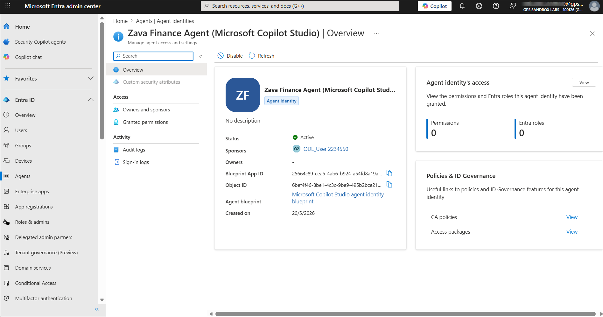

      > **注記:** 新しくプロビジョニングされた環境では、両方の値が **0** を表示します。これにより、Zava Finance Agent エージェント識別情報に API 権限または Entra ディレクトリロールが付与されていないことが確認され、これは予想される最小権限開始状態です。

---

### タスク 3: Patti Fernandes を Zava Finance Agent エージェント識別情報の所有者として割り当てる

1. Zava Finance Agent エージェント識別情報ページの左側のサブナビゲーションで、**[アクセス]** の下から **[所有者とスポンサー]** を選択します。

	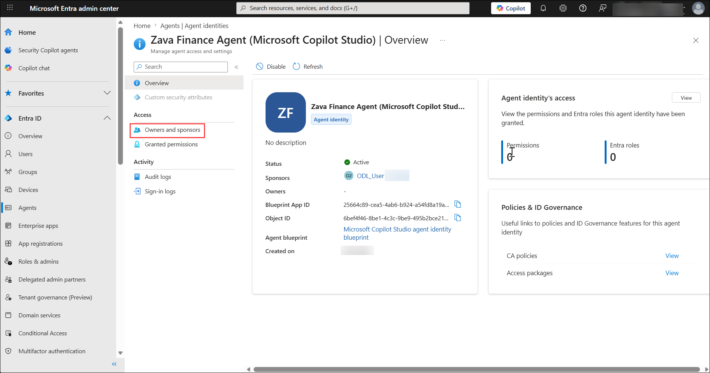

2. **[所有者とスポンサー]** で、**[+ 追加]** を選択して、**[所有者を追加]** をクリックします。

	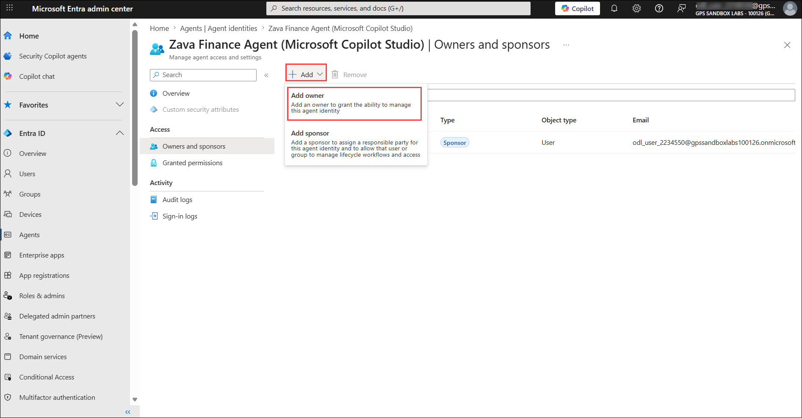

3. **[所有者を追加]** パネルの検索フィールドに `Patti` を入力します。結果から **[Patti Fernandes]** を選択し、**[選択]** をクリックして確認します。

	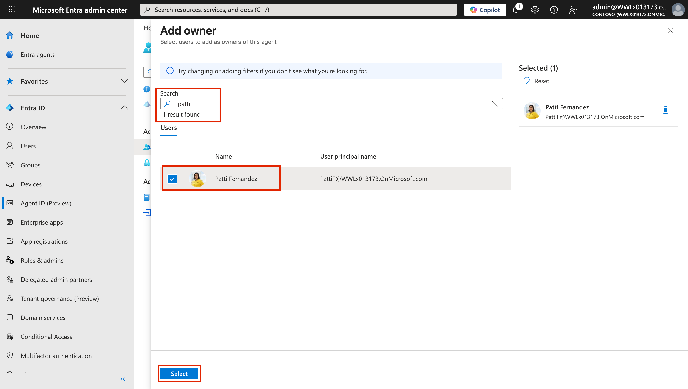

4. **[Patti Fernandes]** が **[所有者とスポンサー]** ページで **[完全な所有者]** として表示されるようになったことを確認します。

	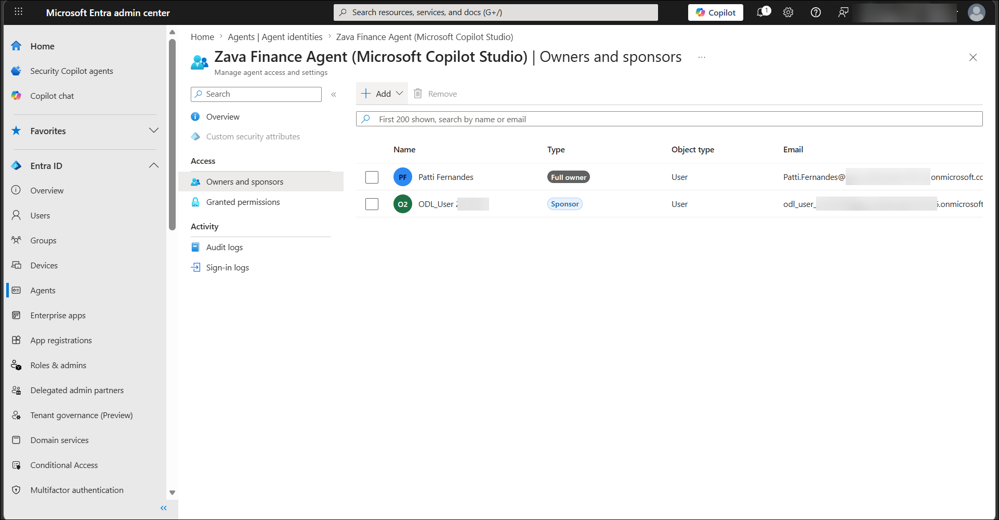

   > **注記:** エージェント識別情報に所有者を割り当てることで、Entra ガバナンスモデル内のその識別情報に対する説明責任を確立します。所有者はアクセスレビュー通知を受け取り、識別情報の継続的な必要性と適切なアクセスを証明する責任があります。

---

## 演習 2: Zava HR Assistant を無効化・再度有効化する

### タスク 1: Zava HR Assistant 識別情報を無効化する

1. Microsoft Entra の **[エージェント識別情報]** ページに戻り、**[Zava HR Assistant]** エージェント識別情報を選択します。

	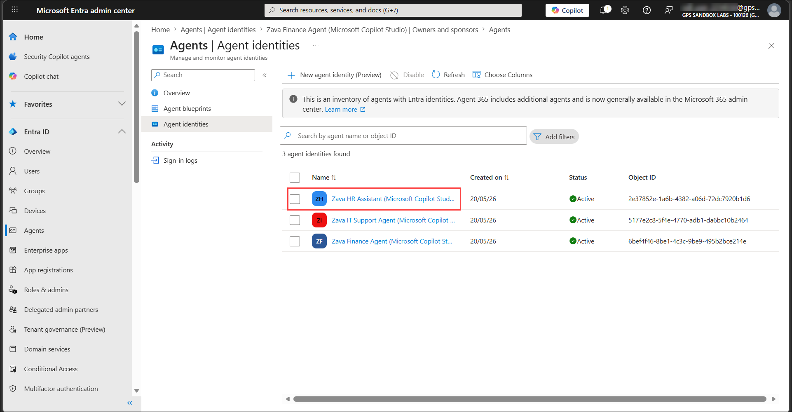

2. ページの上部のツールバーで、**[無効化]** を選択します。

	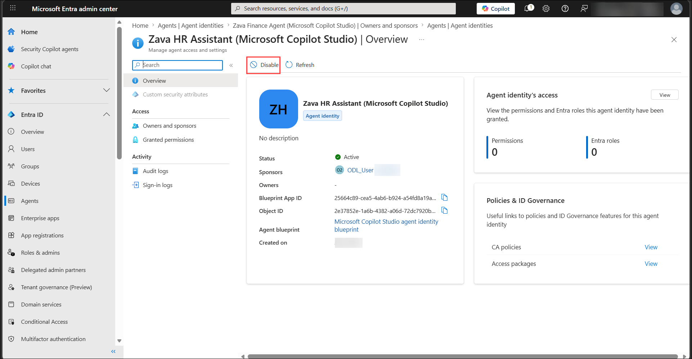

3. 確認ダイアログで、識別情報を無効化するアクションを確認します。

	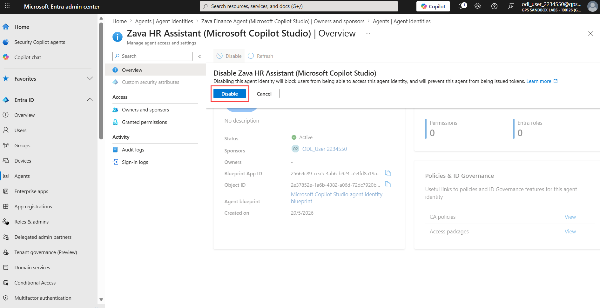

4. ページがリフレッシュされるまで待機します。

5. **[概要]** ページで、**[ステータス]** が **[無効化]** と表示されるようになったことを確認します。

	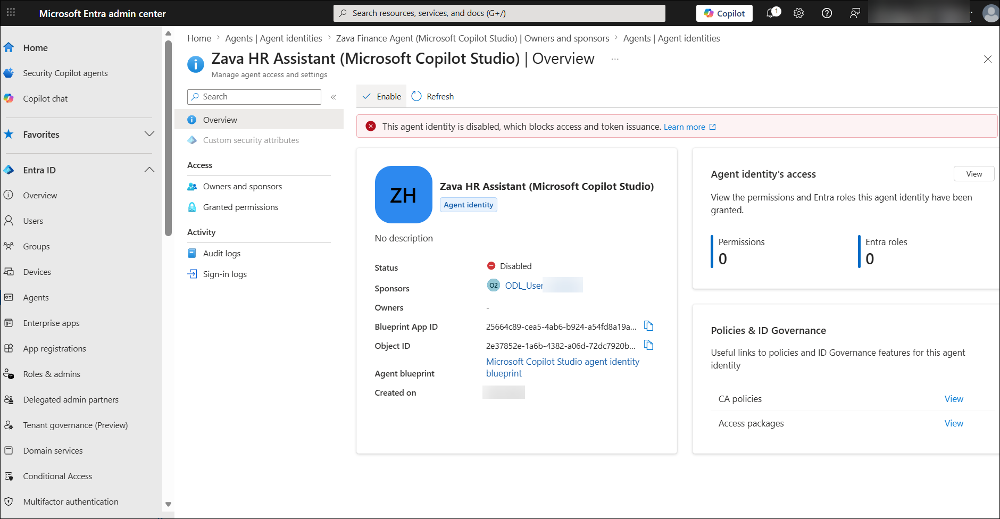

---

### タスク 2: エンドユーザーアクセスがブロックされていることを確認する

1. 新しい **InPrivate** または **Incognito** ブラウザウィンドウを開きます。Copilot studio に移動し、**[サインイン]** をクリックします。

    ```
    https://copilot.microsoft.com
    ```

   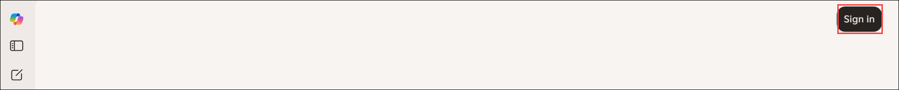

1. **[Microsoftで続行]** をクリックします。

	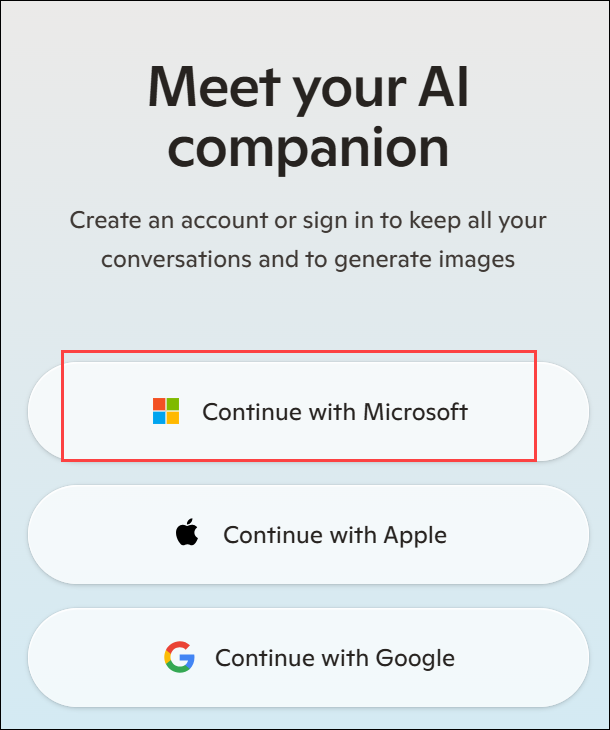

1. **[環境]** タブから **ODL User** 認証情報でサインインします。

   - **メールアドレス/ユーザー名:** <inject key="AzureAdUserEmail"></inject>
   - **パスワード:** <inject key="AzureAdUserPassword"></inject>

1. **[どのCopilotエクスペリエンスをお探しですか?]** で **[仕事]** タブをクリックします。

	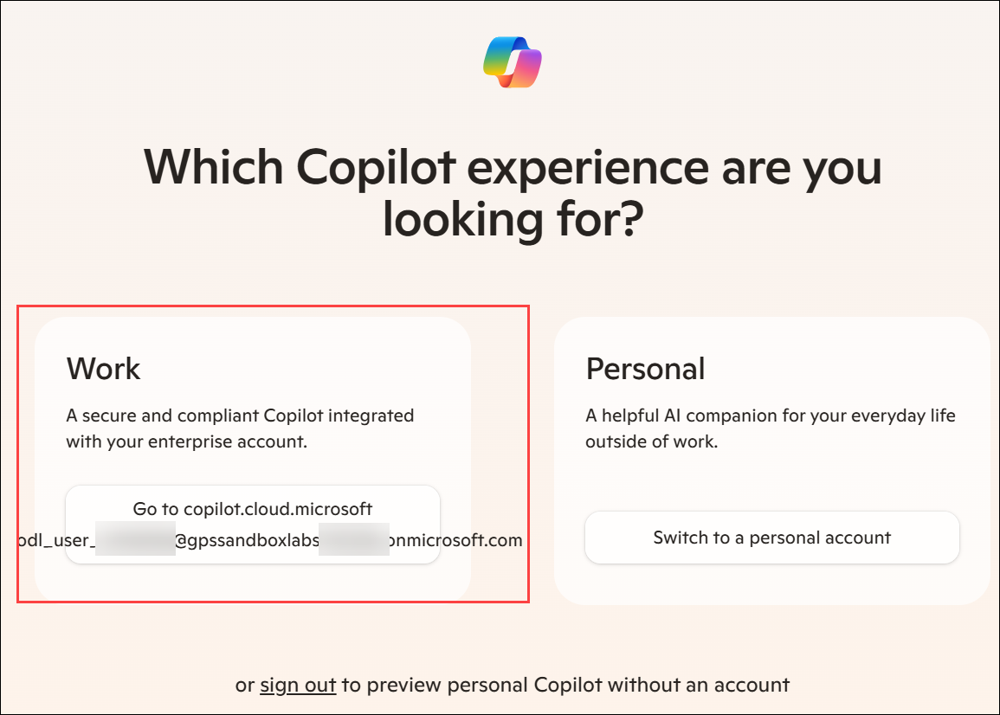

2. 左側のナビゲーションで、**[すべてのエージェント]** を選択してから `Zava` を検索します。

3. 結果をメモします。エージェント **[Zava HR Assistant]** は表示されないはずです。

   > **注記:** 識別情報無効化の伝播には時間がかかる場合があります。無効化直後にエージェントが通常どおり応答する場合は、時間をおいて再度試してください。タスク3に進むことができます。時間がかかる場合があります。

---

### タスク 3: Zava HR Assistant 識別情報を再度有効化する

1. Microsoft Entra 管理センターの **ODL User** ブラウザセッションに戻ります。

    ```
    https://entra.microsoft.com
	```

2. 左側のナビゲーションペインで、**[エージェント]** を選択します。**[エージェント識別情報]** ページで、**[Zava HR Assistant (Microsoft Copilot Studio)]** を選択します。

3. **[概要]** ページで、ツールバーの **[有効化]** を選択します。

	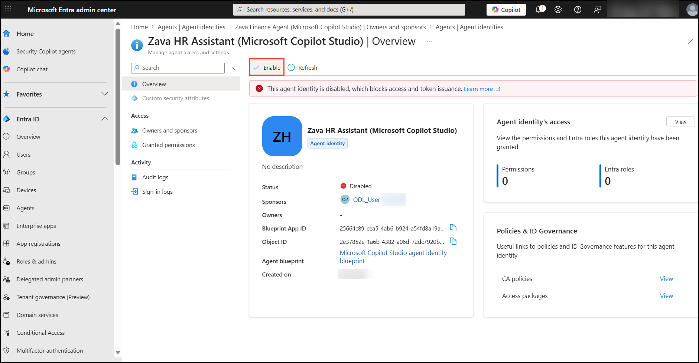

   > **注記:** タスク1で識別情報が無効化された後、ツールバーボタンは **[無効化]** から **[有効化]** に変わります。

4. 確認ダイアログで、識別情報を有効化するアクションを確認します。

	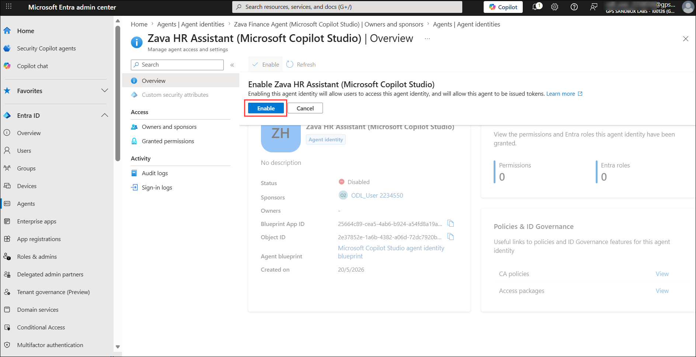

5. ページがリフレッシュされるまで待機します。

6. **[概要(プレビュー)]** ページで、**[ステータス]** が **[アクティブ]** と表示されるようになったことを確認します。

	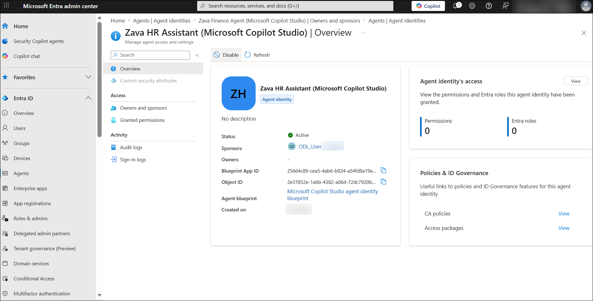

7. エンドユーザーアクセスチェックを繰り返して、エージェントが再度アクセス可能であることを確認します。

---

## まとめ

このラボでは、左側のナビゲーション **[Agent ID]** エントリを使用して Microsoft Entra 管理センターで3つの Zava エージェント識別情報すべてを特定しました。Zava Finance Agent エージェント識別情報概要をレビューし、アクティブステータス、Blueprint ID、オブジェクトID、および割り当てられた所有者の現在の欠如を確認しました。Patti Fernandes を Zava Finance Agent エージェント識別情報の所有者として割り当てて、Entra ガバナンスモデル内で説明責任を確立しました。エージェント識別情報の現在の権限と Entra ロールをレビューし、最小権限デプロイメントで予想される0のスタンディングアクセスを確認しました。

最後に、Zava HR Assistant 識別情報を無効化してアイデンティティ隔離アクションをシミュレートし、Microsoft 365 Copilot 経由でエージェントにアクセスできなくなったことを確認し、識別情報を再度有効化して通常のアクセスを復元しました。Zava エージェント識別情報が可視化され、所有権が割り当てられたガバナンスされた状態にあり、識別情報レベルのライフサイクル制御に応答することが確認されました。Day 1 は完了しました。Day 2 ラボはこの基盤の上に構築され、Zava エージェント環境全体にセキュリティポリシー、条件付きアクセス制御、および脅威検出構成を適用します。
