**Laboratório 02: Configuração e monitoramento da identidade de agentes no Entra**

**Introdução**

A equipe de segurança da Zava recebeu a confirmação do CISO de que todas as identidades dos agentes de IA devem ser revisadas e submetidas a controles de governança antes do início da configuração da política de segurança do dia 2. A verificação do registro no laboratório 01 confirmou que os agentes estão ativos e visíveis, mas a identidade do agente ainda não possui proprietário atribuído e ninguém verificou quais permissões ou funções essas identidades possuem no momento.

Cada agente do Copilot Studio implementado no ambiente Zava recebeu automaticamente uma identidade exclusiva no Microsoft Entra ID quando a identidade do agente Entra foi habilitada no laboratório 00. Essas identidades aparecem na seção **Agent ID** do centro de administração do Microsoft Entra e podem ser gerenciadas como qualquer outra identidade no locatário com proprietários, patrocinadores, controles de acesso, registros de auditoria e políticas de acesso condicional.

Neste laboratório, o MOD Administrator localiza as identidades dos agentes Zava, revisa sua configuração atual, atribui a Patti Fernandes como proprietária do agente financeiro da Zava e desativa e reativa a identidade do assistente de RH Zava para simular uma ação de quarentena de identidade.

**Objetivos**

- Localizar todas as identidades de agentes Zava no centro de administração do Microsoft Entra por meio dos agentes Entra.

- Analisar os metadados de identidade do agente, incluindo status, patrocinadores, proprietários, ID do projeto, ID do objeto e data de criação.

- Atribuir Patti Fernandes como proprietária da identidade do agente financeiro da Zava.

- Analisar as permissões atuais e as funções Entra atribuídas à identidade do agente.

- Verificar os registros de auditoria e de login disponíveis para identificar o agente.

- Analisar a política de acesso condicional e os links do pacote de acesso no painel de identidade do agente.

- Desativar a identidade do assistente de RH da Zava e verificar se o acesso do usuário final está bloqueado.

- Reativar a identidade do assistente de RH da Zava e confirmar se retornou ao status ativo.

**Duração do laboratório**

Tempo estimado: **10 minutos**

**Exercício 1: Localize e inspecione a identidade do agente financeiro da Zava.**

**Tarefa 1: Acesse identidades do agente Entra**

1.  Abra um navegador e acesse `https://entra.microsoft.com`. Faça login com as credenciais **MOD Administrator**, se solicitado.

2.  No painel de navegação à esquerda, selecione **Agent ID**. Na página **All agent identities (Preview)**, revise a lista de identidades de agente registradas no locatário.

	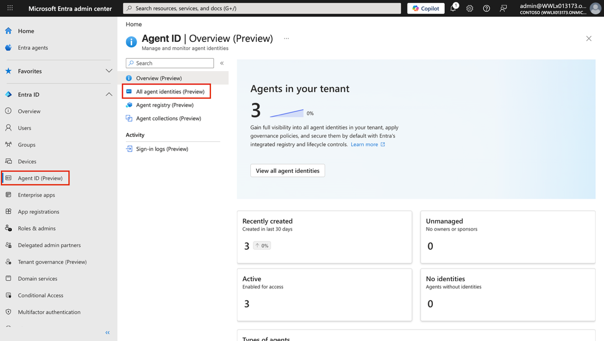

3.  Confirme se os três agentes a seguir constam na lista:

| **Nome de exibição**                             | **Status** |
|--------------------------------------------------|------------|
| Zava HR Assistant (Microsoft Copilot Studio)     | Ativo      |
| Zava Finance Agent (Microsoft Copilot Studio)    | Ativo      |
| Zava IT Support Agent (Microsoft Copilot Studio) | Ativo      |

	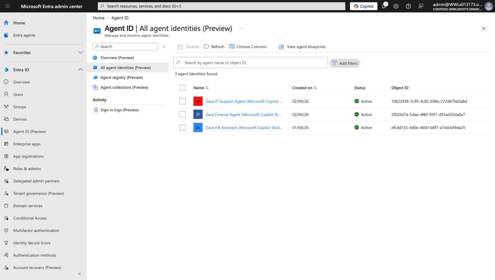

4.  **Observação:** as identidades dos agentes são complementadas com **(Microsoft Copilot Studio)** para indicar a plataforma que as provisionou. Se algum agente não estiver listado, aguarde cinco minutos e atualize a página. O provisionamento da identidade do agente pode levar algum tempo após a publicação inicial no Copilot Studio.

**Tarefa 2: Analise a visão geral da identidade do agente financeiro da Zava.**

1.  Na página **All agent identities (Preview)**, selecione **Zava Finance Agent (Microsoft Copilot Studio)**.

	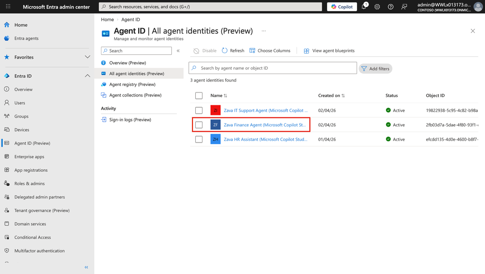

2.  Na página **Overview (Preview)**, revise e anote os seguintes campos:

    - **Status** — confirme se está como **Active**.

    - **Sponsors** — observe os avatares dos usuários atualmente listados como patrocinadores.

    - **Owners** — confirme o valor atual. Observe se há um proprietário designado ou se o campo exibe um traço ( - ), indicando que não há nenhum proprietário definido.

    - **Blueprint ID** — observe o valor GUID.

    - **Object ID** — observe o valor GUID.

    - **Agent blueprint** — observe o texto do link (Microsoft Copilot Studio agent identity).

    - **Created on** — observe a data.

3.  No painel direito, em **Agent identity's access**, observe os valores atuais para:

    - **Permissions**

    - **Entra roles**

	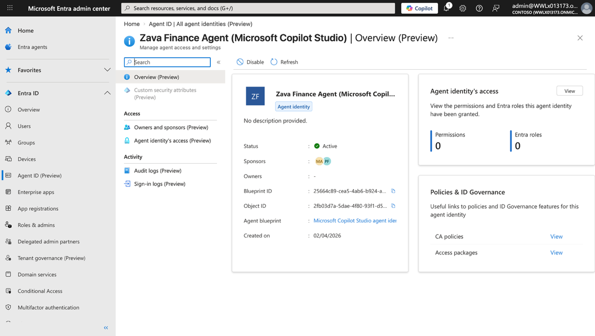

	> **Observação:** Em um ambiente recém-provisionado, ambos os valores serão exibidos como **0.** Isso confirma que a identidade do agente financeiro da Zava não recebeu nenhuma permissão de API ou função de diretório Entra, o que corresponde ao estado inicial esperado de privilégios mínimos.

**Tarefa 3: Atribua Patti Fernandes como proprietária da identidade do agente financeiro da Zava.**

1.  Na subnavegação à esquerda da página de identidade do **Zava Finance Agent**, em **Access**, selecione **Owners and sponsors (Preview)**.

	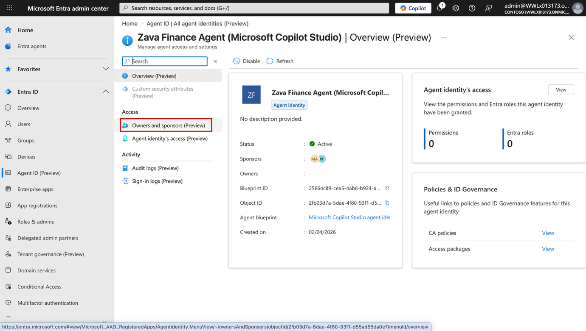

2.  Na página **Owners and sponsors**, confirme que nenhum proprietário está listado no momento. Selecione **+ Add** \> **Add owner**.

	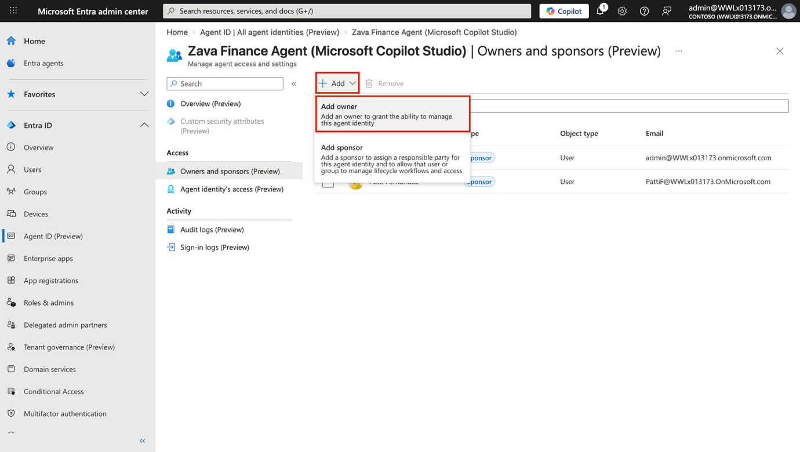

3.  No campo de pesquisa do painel **Add owners**, digite `Patti`. Selecione **Patti Fernandes** nos resultados. Selecione **Select** para confirmar.

	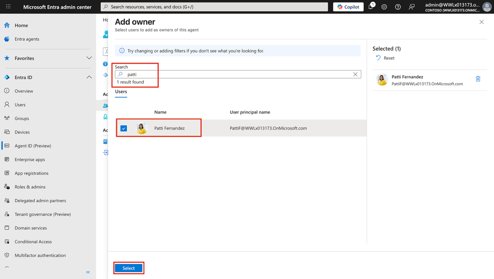

4.  Confirme se **Patti Fernandes** agora aparece como **Owner** na página **Owners and sponsors**.

	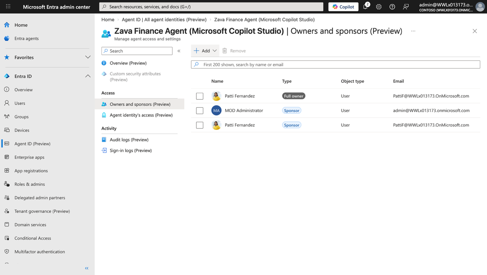

	> **Observação:** A atribuição de um proprietário a uma identidade de agente estabelece a responsabilidade por essa identidade dentro do modelo de governança da Entra. Os proprietários recebem notificações de revisão de acesso e são responsáveis por atestar a necessidade contínua da identidade e a adequação do acesso.

**Exercício 2: Desative e reative o assistente de RH da Zava**

**Tarefa 1: Desative a identidade do assistente de RH da Zava**

1.  Na página **All agent identities (Preview)** do Microsoft Entra, navegue até a página de visão geral da identidade do agente **Zava HR Assistant**.

	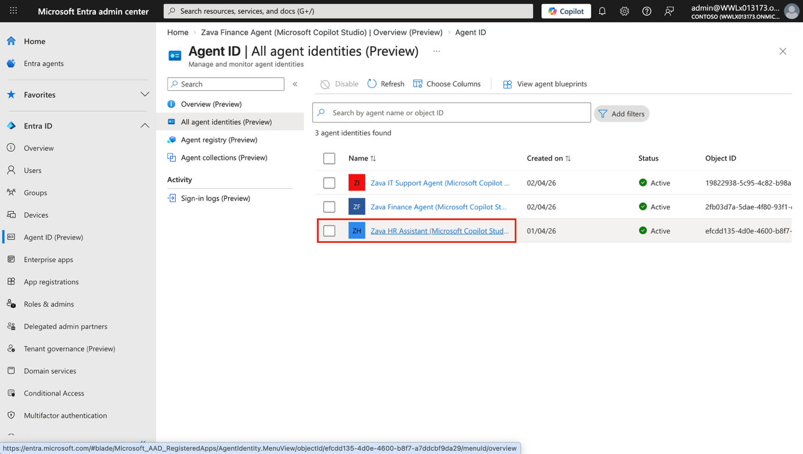

2.  Na barra de ferramentas na parte superior da página, selecione **Disable**.

	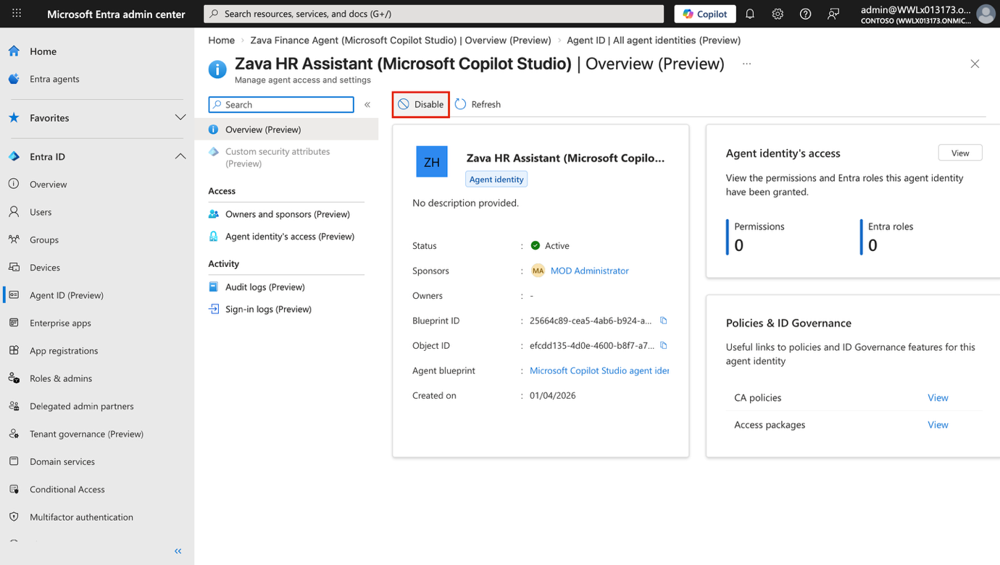

3.  Na caixa de diálogo de confirmação, confirme a ação para desativar a identidade.

	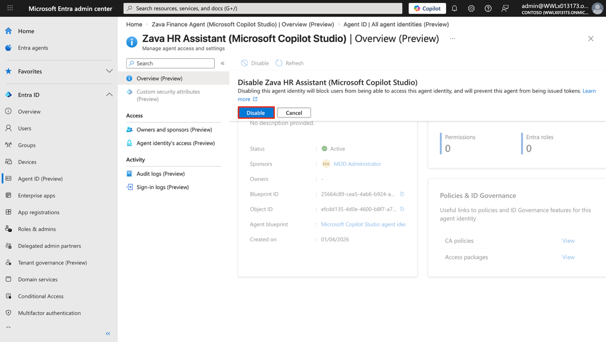

4.  Aguarde a página atualizar.

5.  Na página **Overview (Preview)**, confirme se o **Status** agora está como **Disabled**.

	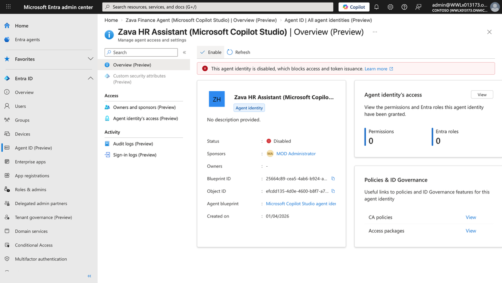

**Tarefa 2: Verifique se o acesso do usuário final está bloqueado**

1.  Abra uma nova janela **InPrivate** ou **Incognito** do navegador. Acesse `https://copilot.microsoft.com`. Faça login com as credenciais **MOD Administrator** na aba **Resources**.

2.  Na navegação à esquerda, selecione **Zava HR Assistant** e, em seguida, pesquise por Zava.

3.  Observe os resultados — o agente **Zava HR Assistant** não deve estar visível.

	> **Observação:** A propagação da desativação da identidade pode levar até cinco minutos. Se o agente responder normalmente logo após a desativação, aguarde de três a cinco minutos e tente novamente. Não avance para a Tarefa 3 até que se confirme que o agente está indisponível.

**Tarefa 3: Reative a identidade do assistente de RH da Zava**

1.  Retorne à sessão do navegador **MOD Administrator** em `https://entra.microsoft.com`.

2.  No painel de navegação à esquerda, selecione **Agent ID**. Na página **All agent identities (Preview)**, selecione **Zava HR Assistant (Microsoft Copilot Studio)**.

3.  Na página **Overview (Preview)**, na barra de ferramentas, selecione **Enable**.

	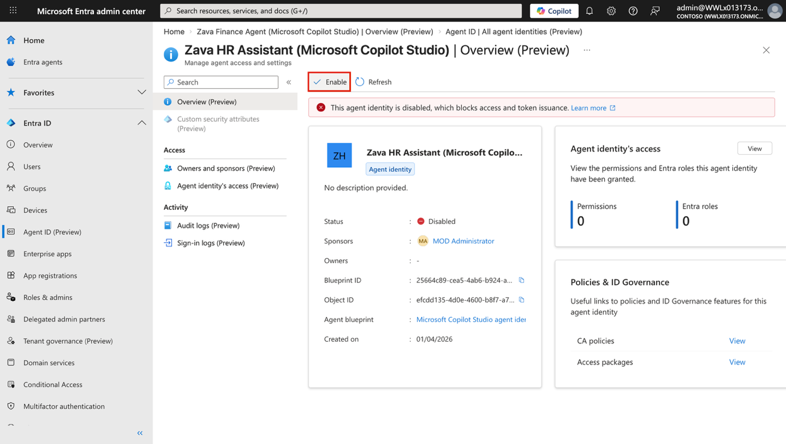

	> **Observação:** O botão da barra de ferramentas terá mudado de **Disable** para **Enable** após a desativação da identidade na Tarefa 1.

4.  Na caixa de diálogo de confirmação, confirme a ação para ativar a identidade.

	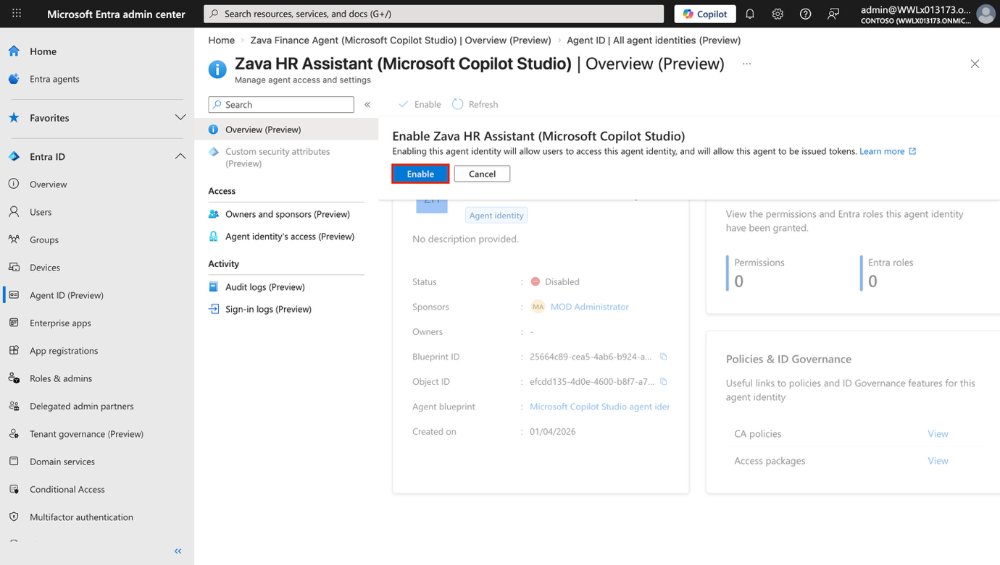

5.  Aguarde a página atualizar.

6.  Na página **Overview (Preview)**, confirme se o **Status** agora está como **Active**.

	

7.  Repita a verificação de acesso do usuário final para confirmar se o agente está acessível novamente.

**Resumo**

Neste laboratório, você localizou todas as três identidades de agente Zava no centro de administração do Microsoft Entra usando a entrada **Agent ID** no menu de navegação à esquerda. Você analisou a visão geral da identidade do agente financeiro da Zava, confirmando seu status “Ativo”, o ID do Blueprint, o ID do Objeto e a ausência atual de proprietários designados. Você designou Patti Fernandes como proprietária da identidade do agente financeiro da Zava para estabelecer a responsabilidade dentro do modelo de governança do Entra. Você revisou as permissões atuais da identidade do agente e as funções do Entra, confirmando permissões atribuídas, conforme esperado em uma implementação de privilégios mínimos.

Por fim, você desativou a identidade do assistente de RH da Zava para simular uma ação de quarentena da identidade, verificou que o agente não estava mais acessível via Microsoft 365 Copilot e reativou a identidade para restaurar o acesso normal. As identidades de agente Zava estão agora confirmadas como visíveis, governadas com propriedade atribuída e responsivas aos controles de ciclo de vida no nível da identidade. O dia 1 está concluído. Os laboratórios do dia 2 se baseiam nessa base para aplicar políticas de segurança, controles de acesso condicional e configuração de detecção de ameaças em todo o ambiente de agente Zava.
