**Laboratório 07: Purview Audit, retenção e Security Copilot**

**Introdução**

O último laboratório do curso de segurança em IA da Zava Corporation reúne investigação de auditoria, gerenciamento do ciclo de vida dos dados e análise de segurança assistida por IA. O Microsoft Purview captura todas as interações do Copilot e dos agentes como um registro de auditoria estruturado, incluindo o contexto do prompt, os arquivos referenciados e os rótulos de confidencialidade aplicados. Esses registros podem ser mantidos para cumprimento de obrigações de conformidade, pesquisados para investigações forenses e analisados usando a inteligência incorporada do Security Copilot.

Neste laboratório, Adele Vance gera sinais de interação de agente direcionados para gerar registros de auditoria. Patti Fernandes investiga essas interações usando o Purview Audit, pesquisando eventos de gerenciamento de agente do CopilotInteraction e do Copilot Studio. O MOD Administrator cria uma política de retenção que rege o ciclo de vida de todos os dados de interação entre o Copilot e os agentes. Patti então usa o Security Copilot, tanto o integrado ao Purview quanto o portal independente para resumir os alertas de DLP e consultar a postura de segurança de IA da organização.

**Cenário**

A equipe jurídica da Zava solicitou que todos os dados de interação dos agentes de IA sejam mantidos por um período mínimo de cinco anos, a fim de cumprir as obrigações regulatórias do setor de serviços financeiros. Paralelamente, o CISO solicitou à equipe do SOC que comprove que o Purview Audit está capturando dados forenses relevantes do conjunto de agentes da Zava e que o Security Copilot pode acelerar a triagem de eventos de segurança relacionados à IA.

Patti Fernandes investigará os registros de auditoria das interações de Adele Vance com o assistente de RH da Zava, analisará os eventos de gerenciamento de agentes registrados desde a criação e publicação dos agentes e confirmará se os eventos de correspondência de DLP estão sendo registrados. O MOD Administrator criará e verificará a política de retenção. Patti concluirá o curso utilizando o Security Copilot para resumir as descobertas de segurança dos dias 2 e 3 em todo o ambiente da Zava.

**Objetivos**

- Gerar sinais de auditoria de interação do agente como Adele Vance por meio do assistente de RH da Zava.

- Pesquisar no Purview Audit por eventos de interação com o Copilot e revisar os campos de registro de interação.

- Pesquisar eventos de gerenciamento de agentes do Copilot Studio, atividades de publicação, configuração e atualização.

- Analisar os registros de auditoria de correspondência DLP gerados pelas políticas do laboratório 04 e do laboratório 06.

- Criar uma política de retenção para as interações do Copilot e do aplicativo de IA, abrangendo todos os usuários.

- Verificar a configuração da política de retenção e confirmar se a localização da política abrange o Copilot Studio.

- Usar o Security Copilot no Purview para resumir os alertas de DLP e consultar a postura da IA.

- Utilizar o Security Copilot de forma independente para executar um prompt personalizado com escopo definido para as descobertas do agente Zava.

**Duração do laboratório**

Tempo estimado: **30 minutos**

**Exercício 1: Gere sinais de auditoria de interação do agente**

**Tarefa 1: Invoque a assistente de RH da Zava como Adele Vance**

1.  Abra uma nova janela **InPrivate** ou **Incognito** do navegador. Acesse `https://copilot.microsoft.com`. Faça login com as credenciais **Adele Vance** na aba **Resources**.

2.  Na interface do Microsoft 365 Copilot Chat, pesquise e selecione **Zava HR Assistant**.

3.  No campo de entrada do chat, digite o seguinte prompt:

    ```
    What is Zava's policy on annual leave entitlement?
    ```

4.  Aguarde a resposta do assistente de RH da Zava.

5.  Digite o seguinte segundo prompt:

    ```
    Can you show me the employee onboarding process at Zava?
    ```

6.  Aguarde a resposta.

7.  Digite o terceiro prompt a seguir, que faz referência a um arquivo confidencial com rótulo:

    ```
    What are the details in the Zava employee records?
    ```

8.  Aguarde a resposta e observe se a política DLP do laboratório 04 bloqueia ou permite a resposta.

9.  Digite o seguinte quarto prompt:

    ```
    Who are the employees listed in the sick leave report?
    ```

10. Aguarde a resposta e anote o resultado.

	> **Observação:** Estas quatro solicitações geram eventos de auditoria do CopilotInteraction com escopo para o assistente de RH da Zava. Os prompts três e quatro fazem referência a arquivos com o rótulo de confidencialidade **Zava-Confidential/HR-Data**, o que produzirá eventos de correspondência de DLP no registro de auditoria se a política do laboratório 04 estiver em vigor. Os registros de auditoria gerados aqui são os principais alvos de investigação no exercício 2.

11. Feche a janela do navegador **InPrivate**.

**Exercício 2: Investigue eventos de interação do Copilot no Purview Audit**

**Tarefa 1: Busque eventos de interação com o Copilot**

1.  Abra uma nova janela **InPrivate** ou **Incognito** do navegador. Acesse `https://purview.microsoft.com`. Faça login com as credenciais de **Patti Fernandes** na aba **Resources**.

2.  No painel de navegação à esquerda, selecione **Solutions** \> **Audit**.

	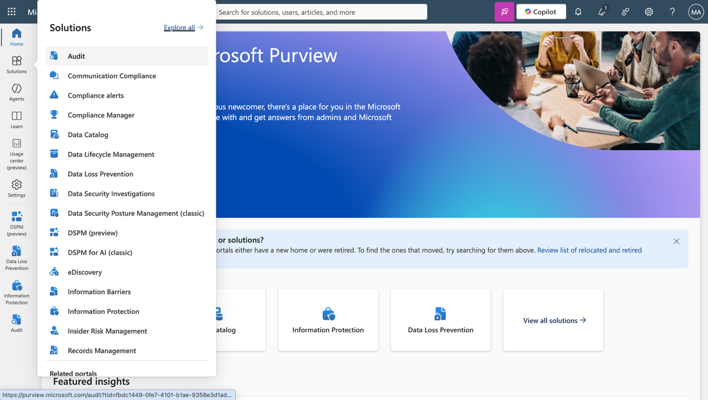

3.  Configure a pesquisa com os seguintes parâmetros:

    - **Start date:** Selecione a data de hoje menos 7 dias.

    - **End date:** Selecione a data de hoje.

    - **Activities – friendly names:** Digite `Copilot activities` e selecione **Interacted with Copilot** no menu suspenso.

    - **Users:** Digite `Adele Vance` e selecione a conta dela nos resultados.

4.  Selecione **Search**.

	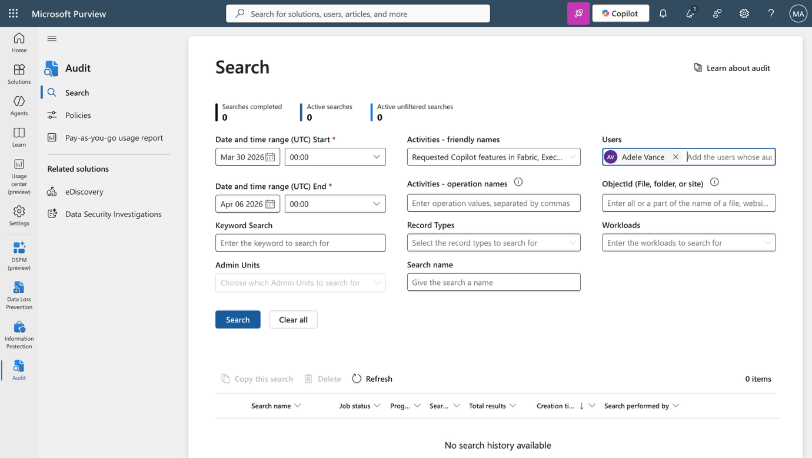

5.  Aguarde a conclusão da tarefa de pesquisa.

6.  Analise os resultados obtidos para as interações de Adele Vance no Copilot.

**Tarefa 2: Analise detalhadamente um registro de auditoria de interação com o Copilot.**

1.  Nos resultados da pesquisa, selecione qualquer entrada de interação para abrir o painel de detalhes do registro de auditoria.

2.  No painel de detalhes, revise os seguintes campos na seção **Audit data**:

    - **Operation** — confirme se está escrito CopilotInteraction.

    - **Workload** — confirme se está escrito Copilot.

    - **UserId** — confirme se mostra o UPN de Adele Vance.

    - **AppHost** — observe a superfície do aplicativo onde a interação ocorreu.

    - **AccessedResources** — revise quaisquer arquivos listados. Observe o nome do arquivo, a URL do site e o SensitivityLabelId, se estiver presente.

    - **AISystemPlugin** — observe se o BingWebSearch aparece, o que indica que a interação utilizou o Bing.

    - **ThreadId** — observe o identificador da conversa.

3.  Feche o painel de detalhes.

4.  Nos resultados da pesquisa, selecione uma entrada de interação que faça referência a um arquivo confidencial, procure por entradas onde **AccessedResources** esteja preenchido.

5.  No painel de detalhes, em **AccessedResources**, confirme que:

    - O nome do arquivo corresponde a um dos arquivos do SharePoint da Zava HR carregados no laboratório 00.

    - O campo SensitivityLabelId está preenchido, confirmando que o rótulo aplicado no laboratório 04 foi registrado no histórico de auditoria.

6.  Feche o painel de detalhes.

	> **Observação:** O texto completo dos prompts e respostas não está incluído nos registros do Purview Audit. Apenas os metadados são referências de arquivos, IDs de rótulos, IDs de threads e contexto da interação são capturados. A transcrição completa pode ser acessada no DSPM Activity Explorer, conforme abordado no laboratório 06. Isso é intencional: os registros de auditoria fornecem o rastro forense, enquanto o DSPM oferece a interface para a investigação do conteúdo.

**Exercício 3: Pesquise eventos de gerenciamento de agentes do Copilot Studio**

**Tarefa 1: Pesquise eventos de auditoria de gerenciamento de agentes**

1.  Na página **Audit**, selecione **New Search**.

2.  Configure a pesquisa com os seguintes valores:

    - **Start date:** Selecione a data em que você concluiu o laboratório 00 (início do curso).

    - **End date:** Selecione a data de hoje.

    - **Activities – friendly names:** Acesse o Copilot Studio e selecione todos os tipos de atividades disponíveis no menu suspenso, incluindo:

      - **Published an agent**

      - **Updated an agent**

      - **Deleted an agent**

      - **Configured an agent**

    - **Users:** Deixe em branco para pesquisar todos os usuários.

3.  Selecione **Search**.

4.  Aguarde a conclusão da tarefa de pesquisa.

5.  Analise os resultados.

6.  Localize uma entrada para **Published an agent** que corresponde a um dos agentes Zava publicados no laboratório 00.

7.  Selecione a entrada para abrir o painel de detalhes.

8.  Analise os seguintes campos:

    - **Operation** — confirme se reflete a ação de publicação.

    - **UserId** — confirme se exibe o UPN do MOD Administrator.

    - **ObjectId** — observe o identificador do agente.

    - **AgentName** — confirme se corresponde a um dos três agentes da Zava.

9.  Feche o painel de detalhes.

	> **Observação:** Os eventos de gerenciamento de agentes do Copilot Studio são registrados automaticamente para todos os locatários, nenhuma configuração adicional é necessária. Esses eventos fornecem o histórico de auditoria administrativa das ações do ciclo de vida do agente, incluindo quem publicou um agente, quando foi configurado pela última vez e se alguma alteração foi feita em suas fontes de conhecimento ou instruções.

**Exercício 4: Pesquise eventos correspondentes ao DLP e crie uma política de retenção.**

**Tarefa 1: Pesquise eventos correspondentes ao DLP**

1.  Na página **Audit**, selecione **New Search**.

2.  Configure a pesquisa com os seguintes valores:

    - **Start date:** Selecione a data de hoje menos 7 dias.

    - **End date:** Selecione a data de hoje.

    - **Activities – friendly names:** Digite DLP e selecione **DLP rule matched** na lista suspensa.

    - **Users:** Deixe em branco.

3.  Selecione **Search**.

4.  Aguarde a conclusão da tarefa de pesquisa.

5.  Analise todos os resultados obtidos.

6.  Se houver eventos correspondentes ao DLP, selecione uma entrada para abrir o painel de detalhes.

7.  No painel de detalhes, observe os seguintes campos:

    - **Policy name** — confirme se ela faz referência à política **Zava - Block HR Data in M365 Copilot** do laboratório 04.

    - **Rule name** — confirme se faz referência ao **Block Copilot access to HR-labelled content**.

    - **Sensitivity label** — confirme se o rótulo acionou a correspondência.

    - **User** — confirme se mostra Adele Vance.

    - **Location** — confirme se exibe a localização do Microsoft 365 Copilot.

8.  Feche o painel de detalhes.

	> **Observação:** Se ainda não houver eventos de correspondência de DLP, isso indica que a política de DLP ainda está sendo propagada para o local do Copilot. Os eventos de DLP para o local do Copilot podem levar até uma hora para aparecer no registro de auditoria após a aplicação. Volte a esta pesquisa após concluir o exercício 4 se os resultados ainda não estiverem disponíveis.

**Tarefa 2: Crie a política de retenção como MOD Administrator**

1.  Abra uma nova aba do navegador e faça login como **MOD Administrator** em `https://purview.microsoft.com`. No painel de navegação à esquerda, selecione **Solutions**. Selecione **Data Lifecycle Management**.

	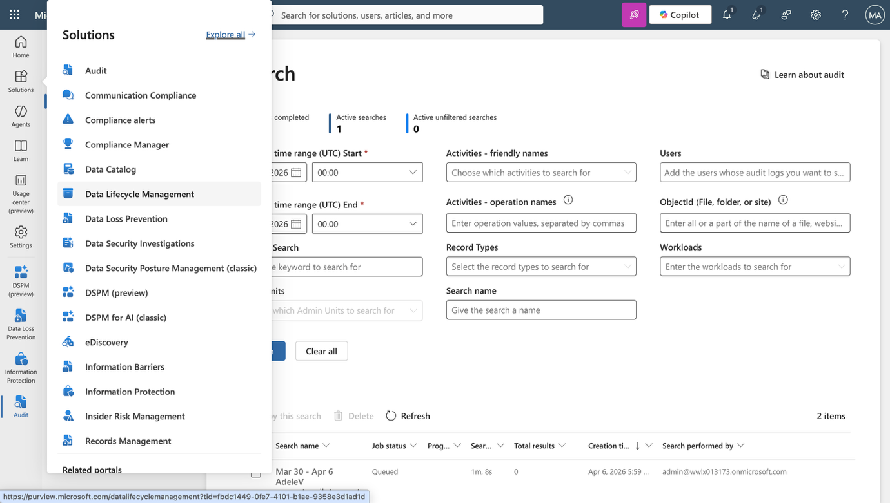

2.  Na subnavegação à esquerda, selecione **Policies**. Selecione **Retention policies** \> **+ New retention policy**.

	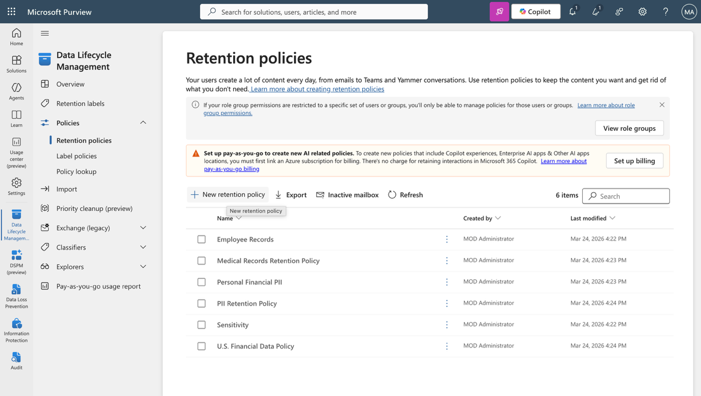

3.  Na página **Name your retention policy**, digite o seguinte:

    - **Name:** `Zava - Retain AI Interactions 5 Year`

    - **Description:** `Retains all Microsoft 365 Copilot and Copilot Studio agent interaction data — including prompts and responses — for a minimum of five years to satisfy Zava financial services regulatory obligations.`

4.  Selecione **Next** até que seja solicitado que você selecione o tipo.

	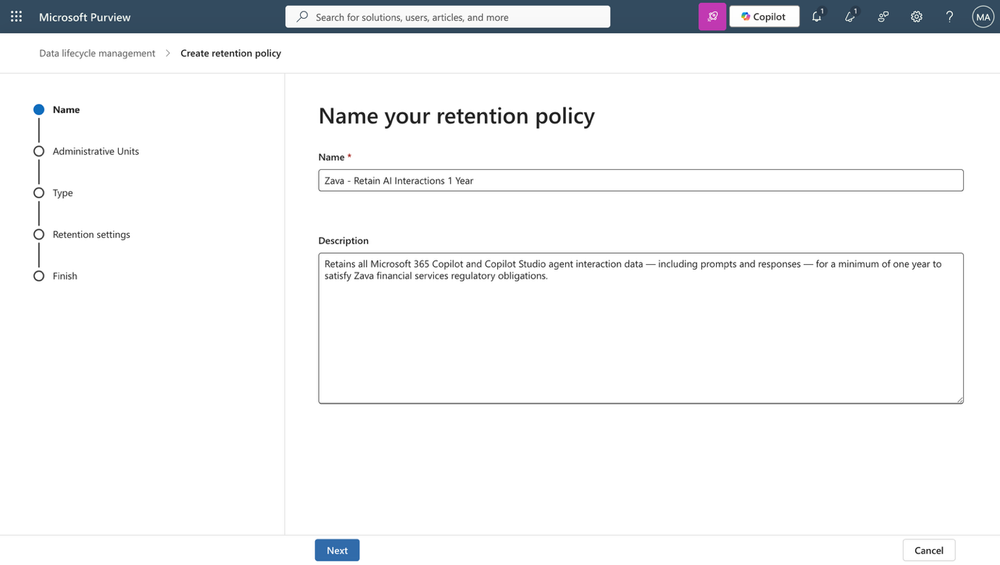

5.  Na página **Choose the type of retention policy to create**, selecione **Static**. Selecione **Next**.

	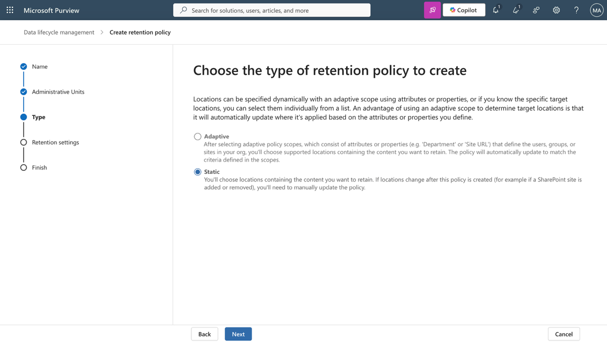

6.  Na página **Choose where to apply this policy**, desmarque todos os locais que estão ativados **On** por padrão. Ative **On** para **Microsoft Copilot experiences**.

7.  Confirme se o escopo mostra **All users** nas entradas incluídas.

	> **Observação:** O local de retenção do **Microsoft 365 Copilot and Copilot Chat** abrange as solicitações e respostas dos usuários para os agentes do Microsoft 365 Copilot e do Copilot Studio. Os dados de interação são armazenados em uma pasta oculta da caixa de correio do Exchange para cada usuário, não diretamente acessível a usuários ou administradores, mas possível pesquisar por meio da eDiscovery e sujeita à política de retenção configurada aqui.

8.  Selecione **Next**.

	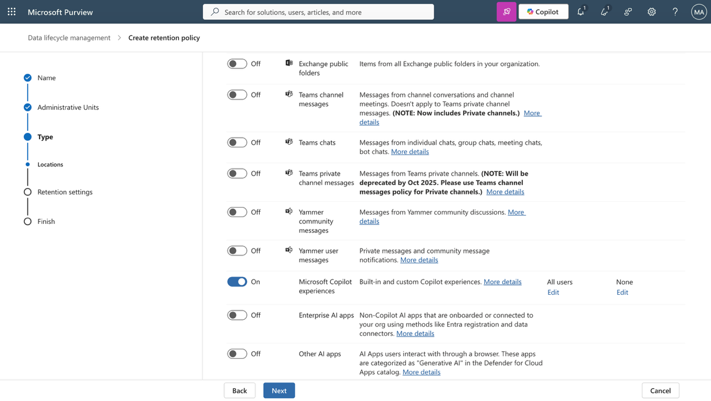

9.  Na página **Decide if you want to retain content, delete it, or both**, configure o seguinte:

    - **Retain items for a specific period:** Selecione **5 anos.**

    - **Start the retention period based on:** Selecione **When items were created**.

    - **At the end of the retention period:** Selecione **Do nothing**.

10. Selecione **Next**.

	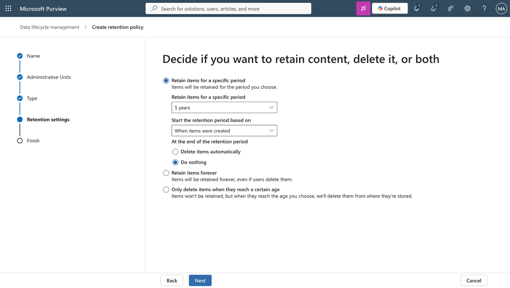

11. Na página **Review and finish**, revise a configuração completa da política.

12. Confirme o seguinte:

- **Nome:** Zava - Retain AI Interactions 5 Year

- **Locations:** Microsoft 365 Copilot e Copilot Chat — Todos os usuários

- **Retention period:** 5 anos a partir da criação.

- **Action after retention:** Não fazer nada.

13. Selecione **Submit**.

	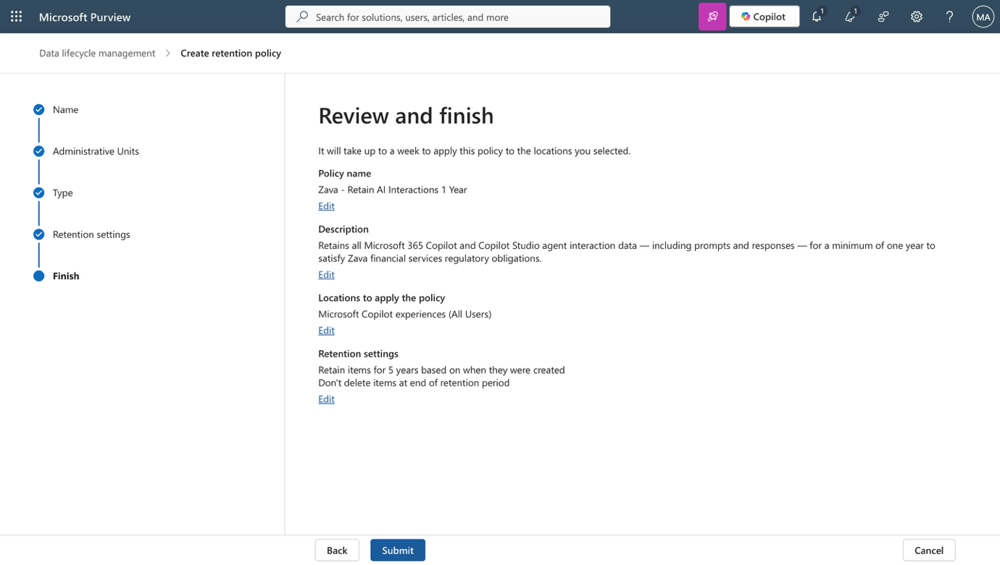

14. Na página de confirmação, selecione **Done**.

	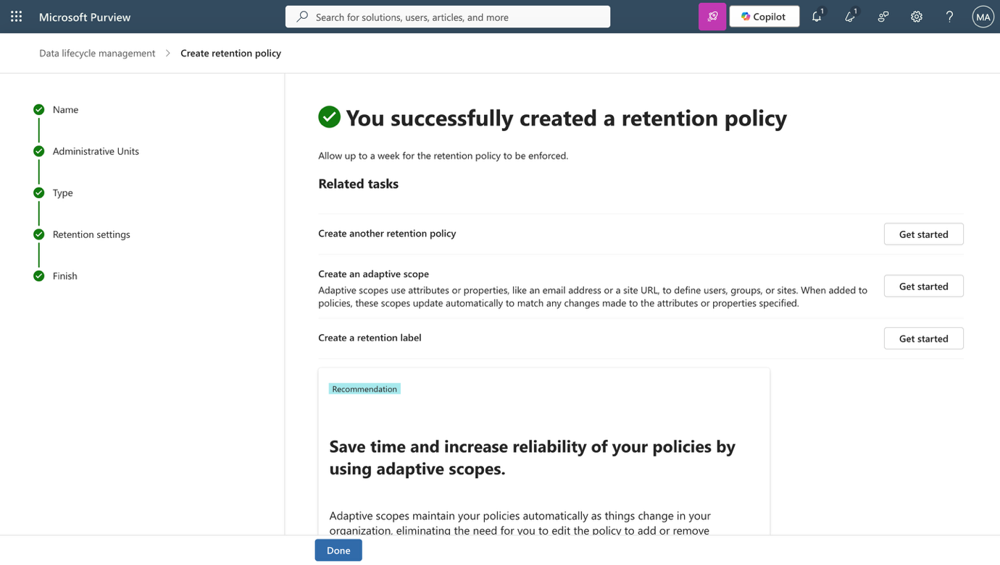

**Tarefa 3: Verifique a política de retenção**

1.  Na página **Retention policies**, localize **Zava - Retain AI Interactions 5 Year**.

2.  Confirme se o status da política mostra **On** ou **Active**.

3.  Selecione a política para abrir o painel de detalhes.

4.  No painel de detalhes, confirme que:

    - **Status** é **On**.

    - **Locations** mostra **Microsoft 365 Copilot and Copilot Chat**.

    - **Retention period** é **5 years**.

	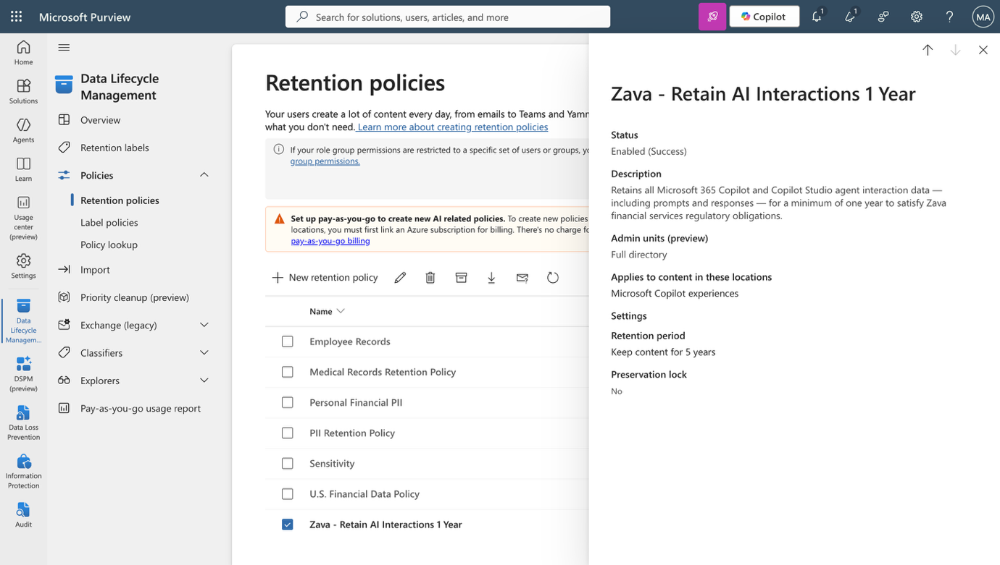

5.  Feche o painel de detalhes.

	> **Observação:** Pode levar até sete dias para que uma nova política de retenção seja distribuída a todos os locais selecionados e aplicada ao conteúdo existente. A política se aplicará a todos os dados novos e existentes de interações com o Copilot e com agentes armazenados na pasta oculta da caixa de correio do Exchange de cada usuário da Zava. Se um usuário deixar a organização, seus dados de interação continuarão sujeitos a esta política durante todo o período de retenção.

**Resumo**

Neste laboratório, você gerou sinais específicos de interação entre o Copilot e o agente na função de Adele Vance, invocando o assistente de RH da Zava com quatro comandos incluindo dois que faziam referência a arquivos de RH com classificação de confidencialidade para criar um registro de auditoria forense significativo. Como Patti Fernandes, você pesquisou no Purview Audit por eventos CopilotInteraction relacionados a Adele Vance, revisou os campos estruturados do registro de auditoria, incluindo AccessedResources, SensitivityLabelId, AppHost e ThreadId, e confirmou que os metadados da classificação de confidencialidade são capturados na trilha de auditoria de interação. Você pesquisou por eventos de gerenciamento de agentes do Copilot Studio e revisou o registro de evento de publicação de um dos agentes Zava, confirmando a cadeia de auditoria administrativa de ponta a ponta. Você pesquisou eventos de correspondência de DLP, confirmando que a política do laboratório 04 gerou registros de auditoria para interações de conteúdo bloqueadas com rótulo de RH.

Como MOD Administrator, você criou a política de retenção Zava - Retenção de interações de IA por 5 anos, com escopo para o Microsoft 365 Copilot e a localização do Copilot Chat, abrangendo todos os usuários nas interações dos agentes do Microsoft 365 Copilot e do Copilot Studio. Você confirmou que a política está ativa e se aplicará a todos os dados de interação armazenados nas pastas ocultas da caixa de correio do Exchange dos usuários.

O curso de segurança em IA da Zava Corporation está concluído. Ao longo de sete laboratórios, você desenvolveu uma estrutura abrangente de governança de segurança para IA, desde a gestão de identidade e registro de agentes, passando por acesso condicional, classificação de dados, DLP, detecção de ameaças, remediação de compartilhamento excessivo, auditoria e retenção, abrangendo todo o ciclo de vida da governança de agentes de IA corporativos utilizando a estrutura de segurança da Microsoft.

 
