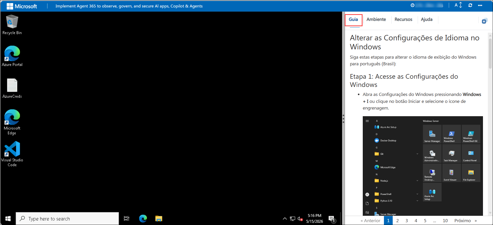
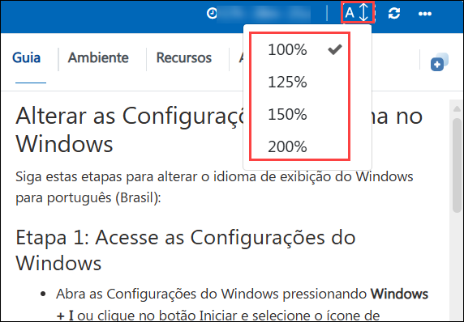
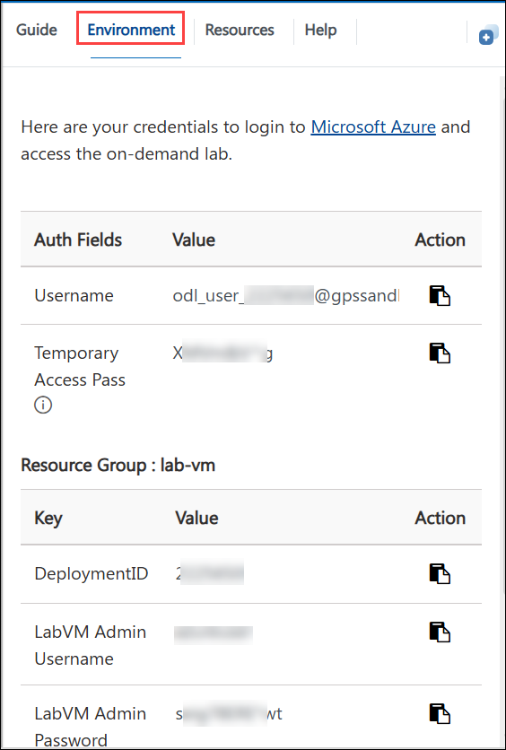
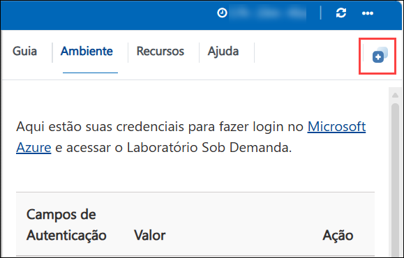
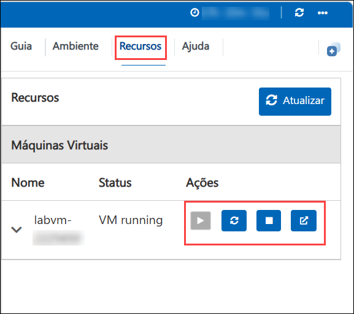
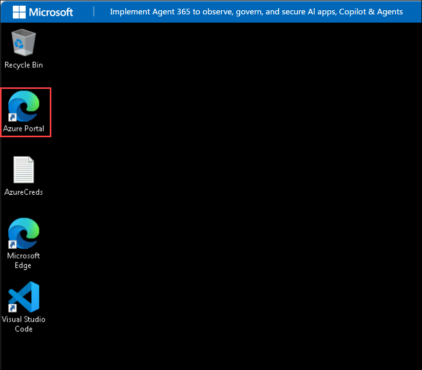
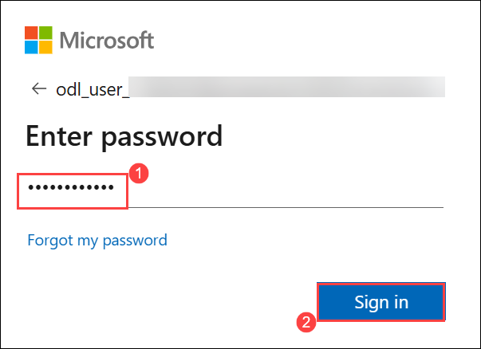
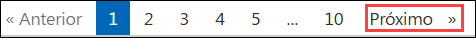

# Implementar o Agent 365 para observar, governar e proteger aplicativos de IA, Copilot e Agentes

### Duração Total Estimada: 8 Horas

## Visão Geral

Neste laboratório prático, você aprenderá sobre a segurança, governança e monitoramento de ponta a ponta de agentes de IA em um ambiente corporativo. Ao assumir várias personas (como Administração, Operações de Segurança e Usuário Final), você implantará agentes personalizados do Copilot Studio, estabelecerá a governança de identidade, aplicará políticas de acesso condicional Zero Trust, governará o compartilhamento de dados e buscará proativamente por riscos de segurança usando o pacote de ferramentas de segurança e conformidade da Microsoft.

## Objetivo

O objetivo principal destes laboratórios é estabelecer uma estrutura abrangente de segurança e governança para agentes de IA. Você aprenderá como:
- Provisionar e gerenciar agentes de IA e suas identidades subjacentes do Entra.
- Estender os controles Zero Trust para agentes de IA usando Atributos de Segurança Personalizados e Acesso Condicional.
- Proteger dados corporativos confidenciais do compartilhamento excessivo de IA por meio de Rótulos de Sensibilidade do Microsoft Purview e políticas de Prevenção contra Perda de Dados (DLP).
- Revelar e investigar agentes não configurados corretamente ou arriscados usando o Microsoft Defender XDR e a Busca Avançada (Advanced Hunting).
- Avaliar os riscos de dados e remediar o compartilhamento excessivo usando o Gerenciamento da Postura de Segurança de Dados (DSPM).
- Cumprir obrigações de conformidade gerenciando logs de auditoria, políticas de retenção e analisando eventos usando o Security Copilot.

## Pré-requisitos

- Um locatário (tenant) do Microsoft 365 equipado com acesso administrativo e licenciamento aplicável para o Microsoft Copilot Studio, Microsoft Entra ID, Microsoft Purview e Microsoft Defender XDR.
- Acesso às personas de laboratório designadas: **MOD Administrator** (Configuração/Admin), **Patti Fernandes** (Analista SOC/Admin de Segurança) e **Adele Vance** (Usuário Final).
- **O Laboratório 00 deve ser concluído primeiro**, pois ele configura o ambiente fundamental. Ele cria os sites necessários do SharePoint (HR e Operations), os grupos de segurança do Entra ID (`copilotagentsecurity`) e os três agentes primários do Zava Copilot Studio (Assistente de RH, Agente Financeiro e Agente de Suporte de TI) que atuam como os alvos de governança para todos os laboratórios subsequentes.

## Explicação dos Componentes

- **Microsoft Copilot Studio:** Usado para criar, gerenciar e implantar agentes de IA personalizados.
- **Microsoft Entra ID:** Gerencia identidades, associações a grupos e impõe o Zero Trust por meio de políticas de Acesso Condicional para agentes de IA.
- **Microsoft Purview:** Fornece políticas de Prevenção contra Perda de Dados (DLP) e Rótulos de Sensibilidade para governar o compartilhamento de dados e evitar exposição excessiva.
- **Microsoft Defender XDR e Defender for Cloud Apps:** Utilizados para a Busca Avançada (Advanced Hunting) e para descobrir agentes não autenticados ou mal configurados.
- **Microsoft Security Copilot:** Auxilia na análise de eventos de auditoria, logs e dados de interação para cumprir obrigações de conformidade.
- **Centro de Administração do Microsoft 365 (Registro de Agentes):** Usado para descobrir, inspecionar e gerenciar o ciclo de vida de agentes de IA personalizados em todo o locatário.

## Primeiros Passos com o laboratório

Bem-vindo(a) ao seu Workshop de Projeto Capstone. Vamos começar aproveitando ao máximo esta experiência:

## Acessando Seu Ambiente de Laboratório

Quando você estiver pronto(a) para começar, sua máquina virtual e o **Guia** estarão na ponta dos seus dedos em seu navegador da web.

## Aumentar/Diminuir o Zoom do Guia do Laboratório

Para ajustar o nível de zoom da página do ambiente, clique no ícone **A↕ : 100%** localizado ao lado do cronômetro no ambiente de laboratório.

## Máquina Virtual e Guia do Laboratório

Sua máquina virtual é o seu burro de carga durante todo o workshop. O guia do laboratório é o seu roteiro para o sucesso.

## Explorando Seus Recursos de Laboratório

Para obter uma melhor compreensão de seus recursos e credenciais de laboratório, navegue até a guia **Environment** (Ambiente).

## Utilizando o Recurso de Tela Dividida

Por conveniência, você pode abrir o guia de laboratório em uma janela separada selecionando o botão **Split Window** (Janela Dividida) no canto superior direito.

## Gerenciando Sua Máquina Virtual

Sinta-se à vontade para **Iniciar, Parar ou Reiniciar (2)** sua máquina virtual conforme necessário a partir da guia **Resources (1)** (Recursos). Sua experiência está em suas mãos!

## Vamos Começar com o Portal do Azure

1. Em sua máquina virtual, clique no ícone do Portal do Azure.

  

2. Você verá a guia **Sign into Microsoft Azure** (Entrar no Microsoft Azure). Aqui, insira suas credenciais:

   - **E-mail/Nome de usuário:** <inject key="AzureAdUserEmail"></inject>

     

3. Em seguida, forneça sua senha:

   - **Senha:** <inject key="AzureAdUserPassword"></inject>

     

4. Se a janela pop-up **Action required** (Ação necessária) for exibida, clique em **Ask later** (Perguntar mais tarde).
5. Se solicitado a **permanecer conectado**, você pode clicar em **Não**.
6. Se a janela pop-up **Welcome to Microsoft Azure** (Bem-vindo ao Microsoft Azure) aparecer, clique simplesmente em **"Cancelar"** para pular o tour.

## Passos para Continuar com a Configuração do MFA se a Opção "Perguntar Mais Tarde" Não Estiver Visível

1. No prompt **"More information required"** (Mais informações necessárias), selecione **Next** (Avançar).

1. Na página **"Keep your account secure"** (Mantenha sua conta segura), selecione **Next** (Avançar) duas vezes.

1. **Nota:** Se você não tiver o aplicativo Microsoft Authenticator instalado no seu dispositivo móvel:

   - Abra a **Google Play Store** (Android) ou a **App Store** (iOS).
   - Procure por **Microsoft Authenticator** e toque em **Instalar**.
   - Abra o aplicativo **Microsoft Authenticator**, selecione **Adicionar conta** e escolha **Conta corporativa ou de estudante**.

1. Um **código QR** será exibido na tela do seu computador.

1. No aplicativo Authenticator, selecione **Verificar um código QR** e escaneie o código exibido na tela.

1. Após escanear, clique em **Next** (Avançar) para prosseguir.

1. No seu telefone, digite o número mostrado na tela do seu computador no aplicativo Authenticator e selecione **Next** (Avançar).
1. Se for solicitado a permanecer conectado, você pode clicar em "Não."

1. Se uma janela pop-up **Welcome to Microsoft Azure** (Bem-vindo ao Microsoft Azure) aparecer, simplesmente clique em "Talvez Mais Tarde" para pular o tour.

## Contato de Suporte

A equipe de suporte da CloudLabs está disponível 24 horas por dia, 7 dias por semana, 365 dias por ano, via e-mail e chat ao vivo para garantir assistência contínua a qualquer momento. Oferecemos canais de suporte dedicados, criados especificamente para alunos e instrutores, garantindo que todas as suas necessidades sejam atendidas de forma rápida e eficiente.

Contatos de Suporte ao Aluno:

- Suporte por E-mail: [cloudlabs-support@spektrasystems.com](mailto:cloudlabs-support@spektrasystems.com)
- Suporte por Chat ao Vivo: https://cloudlabs.ai/labs-support

Clique em **Next** (Avançar) no canto inferior direito para embarcar na sua jornada de Laboratório!

Agora você está pronto(a) para explorar o poderoso mundo da tecnologia. Sinta-se à vontade para entrar em contato se tiver alguma dúvida no caminho. Aproveite o seu workshop!