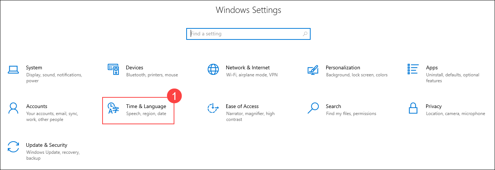
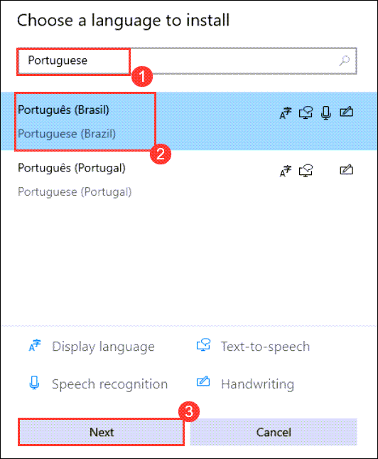
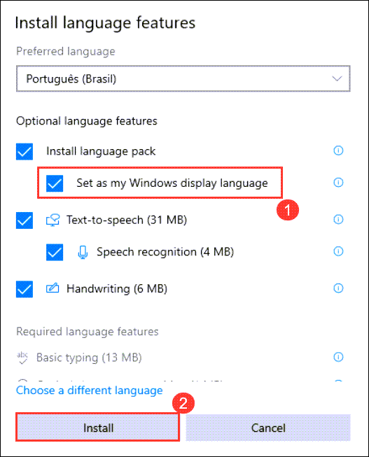
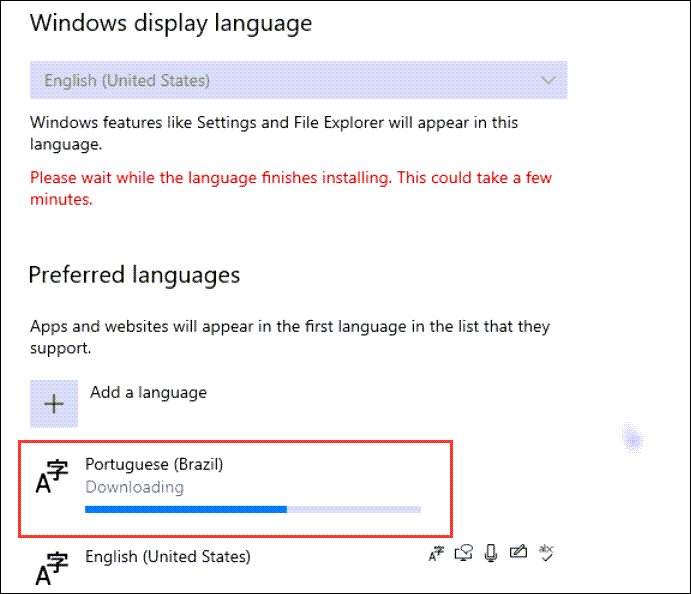
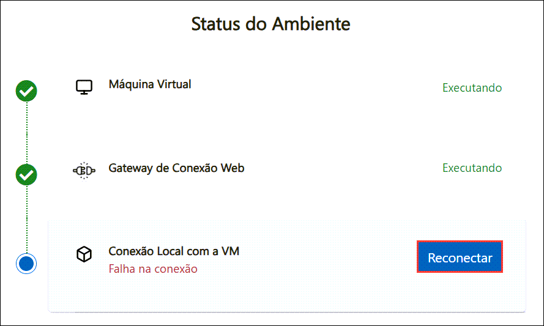

# Alterar as Configurações de Idioma no Windows

Siga estas etapas para alterar o idioma de exibição do Windows para português (Brasil):

## Etapa 1: Acesse as Configurações do Windows

   - Abra as Configurações do Windows pressionando **Windows + I** ou clique no botão Iniciar e selecione o ícone de engrenagem.

      

## Etapa 2: Vá para as Opções de Idioma
   
   - No menu de configurações, selecione **Hora e idioma**.

      

   - No painel à esquerda, clique em **Idioma** e, em seguida, clique em **Adicionar um idioma**.

      

## Etapa 3: Selecione o idioma português

   - Na barra de busca, digite **pt-BR** ou procure por **português (Brasil)** na lista, selecione-o e clique em **Avançar**.

      

   - Na próxima tela, marque a caixa **Definir como meu idioma de exibição do Windows** e clique em **Instalar**.

      

## Etapa 4: Conclua a Instalação

   - Aguarde enquanto o pacote de idioma em português é baixado e instalado.

      

   - Caso apareça um pop-up solicitando para sair da conta, clique em **Sim, sair agora** para aplicar as alterações.

      

   - Se estiver usando uma máquina virtual, clique em **Reconectar** para restabelecer a conexão.

      

## Etapa 5: Verifique as Alterações

Após entrar novamente, o Windows será exibido em português (Brasil).